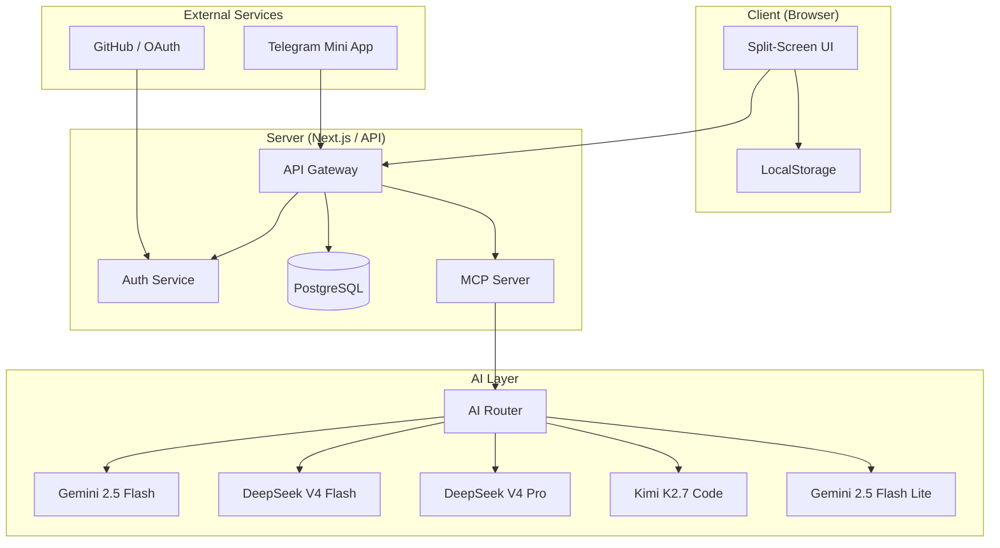
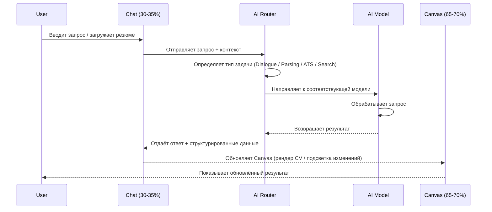

# TO BE Architecture — cv.sarkhan.dev

> **Статус:** Целевая архитектура (TO BE)
> **Версия:** 1.0
> **Дата:** 2026-07-03

---

## 1. Split-Screen Layout

Приложение использует двухпанельный (Split-Screen) интерфейс:

| Панель  | Ширина     | Назначение                                    |
|---------|------------|-----------------------------------------------|
| **Чат** | 30–35%     | Диалоговый интерфейс, ввод запросов, история  |
| **Canvas** | 65–70% | Визуализация CV, редактирование, предпросмотр |

- Чат расположен слева, Canvas — справа.
- Между панелями — изменяемый сплиттер (resize handle).
- На мобильных устройствах панели переключаются табами (Chat / Canvas).

---

## 2. Privacy-First Storage

| Режим пользователя | Хранилище          | Согласие | Особенности                        |
|--------------------|--------------------|----------|------------------------------------|
| **Гость**          | LocalStorage        | Не требуется | Данные живут только в браузере    |
| **Зарегистрированный** | PostgreSQL     | Требуется явное согласие | Данные привязаны к аккаунту       |

- Гость может в любой момент зарегистрироваться — данные мигрируют из LocalStorage в PostgreSQL.
- Пользователь может удалить свои данные в любой момент (GDPR-ready).
- Никакие данные не покидают клиент без явного согласия.

---

## 3. AI Model Routing

| Задача                    | Модель                  | Обоснование                              |
|---------------------------|-------------------------|------------------------------------------|
| **Dialogue** (чат)        | Gemini 2.5 Flash / DeepSeek V4 Flash | Низкая задержка, дешёво для диалога |
| **Parsing** (парсинг резюме) | DeepSeek V4 Pro     | Высокая точность извлечения структуры   |
| **ATS** (анализ совместимости) | Kimi K2.7 Code   | Специализирован на HR-метриках и ATS    |
| **Search** (поиск)        | Gemini 2.5 Flash Lite  | Лёгкая модель, быстрый поиск            |

---

## 4. Architecture Diagram

---

## 5. Sequence Diagram — Data Flow

---

## 6. Monetization

| Уровень     | Цена     | Лимиты и возможности                                      |
|-------------|----------|-----------------------------------------------------------|
| **Guest**   | Бесплатно | 1 демо-резюме, водяной знак на экспорте                   |
| **Free**    | Бесплатно | До 3 резюме, базовые шаблоны                              |
| **Pro**     | $3/мес   | Безлимит резюме, MCP-доступ, ATS-анализ, HR-Coach, все шаблоны, без водяного знака |

- **Guest → Free:** регистрация (email или OAuth).
- **Free → Pro:** подписка через Stripe / Telegram Payments.
- **Pro** включает доступ к MCP-серверу для интеграции с внешними инструментами.

---

## 7. Key Design Decisions

1. **Split-Screen** — одновременная работа с чатом и визуальным редактором без переключения контекста.
2. **AI Router** — единая точка маршрутизации позволяет менять модели без изменения клиентского кода.
3. **Privacy-First** — данные гостей никогда не покидают браузер без согласия.
4. **MCP Server** — открывает API для внешних интеграций (HR-инструменты, ATS-платформы).
5. **Telegram Mini App** — дополнительный канал доступа без установки нативного приложения.

---

## 8. Technology Stack (предварительно)

| Компонент          | Технология                          |
|--------------------|-------------------------------------|
| Frontend           | Next.js (React) + Tailwind CSS      |
| Split-Screen       | Custom resizable panels / react-resizable-panels |
| State Management   | Zustand / Jotai                     |
| Backend            | Next.js API Routes / tRPC           |
| Database           | PostgreSQL + Prisma ORM             |
| Auth               | NextAuth.js (OAuth + Credentials)   |
| AI Router          | Custom middleware + model SDKs       |
| MCP Server         | Fastify / Hono                      |
| Deployment         | Vercel (frontend) + Railway (backend) |
| Payments           | Stripe                              |
