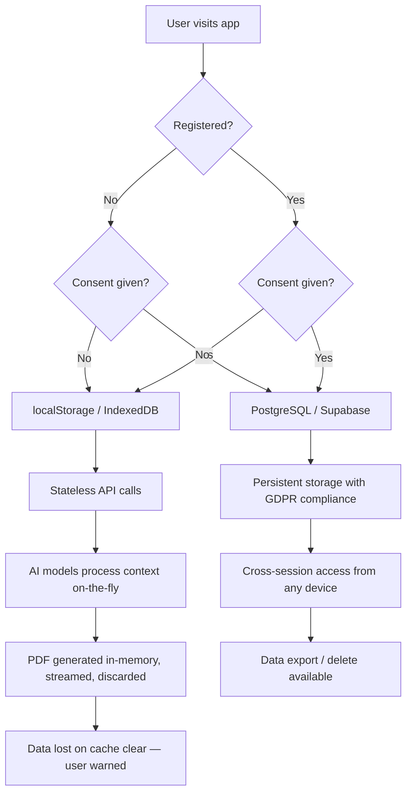

# Storage Strategies

**Status:** Draft  
**Last Updated:** 2026-07-03  
**Owner:** CTO (Sarkhan)

## Privacy-First Architecture

cv.sarkhan.dev follows a strict **privacy-first** data model. No user data is ever stored server-side without explicit, logged consent. The system operates in two distinct modes:

| Mode | Storage Layer | Consent Required | Data Persistence |
|------|--------------|-----------------|-----------------|
| **Guest** (unregistered) | `localStorage` / `IndexedDB` (client) | No | Session-only, lost on cache clear |
| **Registered** (authenticated) | PostgreSQL / Supabase (server) | Yes (logged) | Cross-session, exportable, deletable |

### Storage Decision Tree



### 1. Guest Mode (No Registration, No Consent)

**Storage:** `localStorage` / `IndexedDB` (client-side only)

**Characteristics:**
- Full resume state (JSON) stored strictly on the client's browser
- Every AI request carries the full context as a stateless payload — no server-side session
- No server-side persistence of user data whatsoever
- PDF generation: rendered in-memory on server, streamed to client, never written to disk
- Data is **irrecoverably lost** when the user clears browser cache (explicit warning shown)
- Guest PDFs receive a subtle watermark: *"Created with cv.sarkhan.dev — Upgrade to Pro to remove"*

**Implementation:**

```typescript
interface StorageStrategy {
  save(key: string, data: ResumeData): void;
  load(key: string): ResumeData | null;
  delete(key: string): void;
  clear(): void;
  exists(key: string): boolean;
}

class LocalStorageAdapter implements StorageStrategy {
  private readonly prefix = 'cv_sarkhan_';

  save(key: string, data: ResumeData): void {
    try {
      const serialized = JSON.stringify(data);
      localStorage.setItem(`${this.prefix}${key}`, serialized);
    } catch (e) {
      if (e instanceof DOMException && e.name === 'QuotaExceededError') {
        console.warn('localStorage quota exceeded — evicting oldest entry');
        this.evictOldest();
        this.save(key, data); // retry
      }
    }
  }

  load(key: string): ResumeData | null {
    const raw = localStorage.getItem(`${this.prefix}${key}`);
    if (!raw) return null;
    try {
      return JSON.parse(raw) as ResumeData;
    } catch {
      console.warn(`Corrupt data for key ${key}, removing`);
      this.delete(key);
      return null;
    }
  }

  delete(key: string): void {
    localStorage.removeItem(`${this.prefix}${key}`);
  }

  clear(): void {
    const keys = Object.keys(localStorage).filter(k =>
      k.startsWith(this.prefix)
    );
    keys.forEach(k => localStorage.removeItem(k));
  }

  exists(key: string): boolean {
    return localStorage.getItem(`${this.prefix}${key}`) !== null;
  }

  private evictOldest(): void {
    const entries = Object.keys(localStorage)
      .filter(k => k.startsWith(this.prefix))
      .map(k => ({ key: k, time: Number(k.split('_').pop() || '0') }))
      .sort((a, b) => a.time - b.time);
    if (entries.length > 0) {
      localStorage.removeItem(entries[0].key);
    }
  }
}

class AutoSaveManager {
  private strategy: StorageStrategy;
  private debounceTimer: ReturnType<typeof setTimeout> | null = null;
  private readonly DEBOUNCE_MS = 500;

  constructor(strategy: StorageStrategy) {
    this.strategy = strategy;
  }

  /** Debounced auto-save — called on every field change */
  scheduleSave(key: string, data: ResumeData): void {
    if (this.debounceTimer) clearTimeout(this.debounceTimer);
    this.debounceTimer = setTimeout(() => {
      this.strategy.save(key, data);
      this.debounceTimer = null;
    }, this.DEBOUNCE_MS);
  }

  /** Force an immediate save (on navigation / before unload) */
  flushSave(key: string, data: ResumeData): void {
    if (this.debounceTimer) {
      clearTimeout(this.debounceTimer);
      this.debounceTimer = null;
    }
    this.strategy.save(key, data);
  }
}
```

### 2. Registered User (With Consent)

**Storage:** PostgreSQL / Supabase

**Characteristics:**
- User must explicitly consent to data storage (checkbox + GDPR notice + consent log)
- Resume data persisted in relational DB with full version history
- Cross-session access — login from any device, pick up where you left off
- Data export (JSON) and full deletion available (GDPR right to access / erasure)
- 12-month inactivity auto-deletion policy

**Schema:**

```sql
-- ============================================================
-- Users
-- ============================================================
CREATE TABLE users (
  id            UUID PRIMARY KEY DEFAULT gen_random_uuid(),
  telegram_id   TEXT UNIQUE,
  email         TEXT UNIQUE,
  auth_provider TEXT NOT NULL CHECK (auth_provider IN ('telegram', 'google', 'apple', 'email')),
  created_at    TIMESTAMPTZ NOT NULL DEFAULT NOW(),
  updated_at    TIMESTAMPTZ NOT NULL DEFAULT NOW()
);

-- ============================================================
-- Consent Log (immutable audit trail)
-- ============================================================
CREATE TYPE consent_type AS ENUM ('storage', 'marketing', 'ai_training');

CREATE TABLE consent_log (
  id            UUID PRIMARY KEY DEFAULT gen_random_uuid(),
  user_id       UUID NOT NULL REFERENCES users(id) ON DELETE CASCADE,
  consent_type  consent_type NOT NULL,
  granted       BOOLEAN NOT NULL,
  ip_address    INET,
  user_agent    TEXT,
  timestamp     TIMESTAMPTZ NOT NULL DEFAULT NOW()
);

CREATE INDEX idx_consent_log_user ON consent_log(user_id, consent_type, timestamp DESC);

-- ============================================================
-- Resumes
-- ============================================================
CREATE TABLE resumes (
  id         UUID PRIMARY KEY DEFAULT gen_random_uuid(),
  user_id    UUID NOT NULL REFERENCES users(id) ON DELETE CASCADE,
  title      TEXT NOT NULL DEFAULT 'Untitled Resume',
  data       JSONB NOT NULL,
  version    INT NOT NULL DEFAULT 1,
  created_at TIMESTAMPTZ NOT NULL DEFAULT NOW(),
  updated_at TIMESTAMPTZ NOT NULL DEFAULT NOW()
);

CREATE INDEX idx_resumes_user ON resumes(user_id, updated_at DESC);

-- ============================================================
-- Resume Versions (full history for undo / rollback)
-- ============================================================
CREATE TABLE resume_versions (
  id          UUID PRIMARY KEY DEFAULT gen_random_uuid(),
  resume_id   UUID NOT NULL REFERENCES resumes(id) ON DELETE CASCADE,
  version     INT NOT NULL,
  data        JSONB NOT NULL,
  diff        JSONB,  -- optional: patch diff from previous version
  created_at  TIMESTAMPTZ NOT NULL DEFAULT NOW(),
  UNIQUE(resume_id, version)
);

CREATE INDEX idx_resume_versions ON resume_versions(resume_id, version DESC);

-- ============================================================
-- MCP Tokens (for external integrations)
-- ============================================================
CREATE TABLE mcp_tokens (
  id            UUID PRIMARY KEY DEFAULT gen_random_uuid(),
  user_id       UUID NOT NULL REFERENCES users(id) ON DELETE CASCADE,
  provider      TEXT NOT NULL,  -- 'linkedin', 'indeed', 'hh_ru', etc.
  access_token  TEXT NOT NULL,
  refresh_token TEXT,
  expires_at    TIMESTAMPTZ,
  scopes        TEXT[],
  created_at    TIMESTAMPTZ NOT NULL DEFAULT NOW(),
  updated_at    TIMESTAMPTZ NOT NULL DEFAULT NOW()
);

CREATE INDEX idx_mcp_tokens_user ON mcp_tokens(user_id, provider);
```

### 3. PDF Generation

| Aspect | Guest | Registered |
|--------|-------|-----------|
| Rendering | In-memory on server | In-memory on server |
| Storage | Discarded after stream | Optionally saved to user's storage (with consent) |
| Watermark | "Created with cv.sarkhan.dev — Upgrade to Pro to remove" | None (Pro users) |
| Retention | Never persisted | Until user deletes or inactivity timeout |

### 4. GDPR Compliance Checklist

- [x] **Explicit consent checkbox** — shown before any data storage, not pre-checked
- [x] **Consent log** — immutable audit trail with timestamp, IP, and user agent
- [x] **Right to access** — user can export all their data as JSON from settings
- [x] **Right to erasure** — "Delete my account" removes user + all associated data (cascading FK deletes)
- [x] **Data portability** — export includes resumes, versions, and consent history
- [x] **Data retention policy** — auto-delete after 12 months of inactivity (cron job)
- [x] **Privacy policy page** — `/privacy` with plain-language explanation
- [x] **Cookie consent banner** — only essential localStorage (no tracking cookies)
- [x] **Data Processing Agreement (DPA)** — in place with Supabase / cloud provider
- [x] **Breach notification plan** — 72-hour notification procedure documented

### 5. Migration Path: Guest → Registered

When a guest user registers, their localStorage data is migrated to the server:

```typescript
async function migrateGuestToRegistered(
  guestKey: string,
  userId: string,
  localAdapter: LocalStorageAdapter,
  remoteAdapter: RemoteStorageAdapter
): Promise<void> {
  const data = localAdapter.load(guestKey);
  if (!data) return;

  // User has already consented during registration
  await remoteAdapter.save(`resume_${userId}`, data);
  localAdapter.delete(guestKey);

  console.info(`Migrated guest data for user ${userId}`);
}
```
