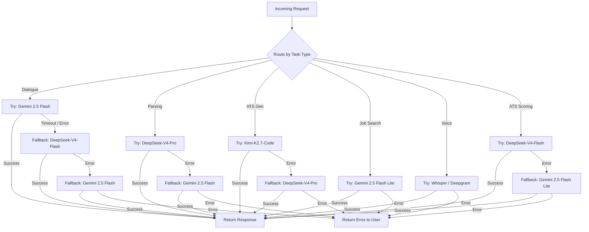

# Model Routing Chain

**Status:** Draft  
**Last Updated:** 2026-07-03  
**Owner:** CTO (Sarkhan)

## Model Routing Logic

cv.sarkhan.dev uses a **task-aware model router** that selects the optimal LLM for each operation. Every task has a primary model and one or more fallbacks. If the primary times out, returns an error, or produces invalid output, the router cascades through fallbacks before surfacing an error to the user.

### Routing Table

| Task | Primary Model | Fallback 1 | Fallback 2 | Rationale |
|------|--------------|------------|------------|-----------|
| **Live Agent** (dialogue, user guidance) | Gemini 2.5 Flash | DeepSeek-V4-Flash | — | Speed, empathy, cheap streaming |
| **Chaotic text parsing** (LinkedIn import, PDF extraction) | DeepSeek-V4-Pro | Gemini 2.5 Flash | — | Strong reasoning for structure extraction |
| **ATS optimization** (content generation, scoring) | Kimi-K2.7-Code | DeepSeek-V4-Pro | — | Strict JSON schema adherence, professional vocabulary |
| **Job search** (web scraping, vacancy analysis) | Gemini 2.5 Flash Lite | — | — | Fast web parsing, cheap scoring |
| **Voice transcription** | Whisper / Deepgram | — | — | Specialized STT models |
| **ATS scoring** (match analysis) | DeepSeek-V4-Flash | Gemini 2.5 Flash Lite | — | Quick analysis, cheap |

### Fallback Chain Flowchart



### Implementation

```typescript
// ============================================================
// Types
// ============================================================

type TaskType =
  | 'dialogue'
  | 'parsing'
  | 'ats_generation'
  | 'ats_scoring'
  | 'job_search'
  | 'voice_transcription';

interface ModelConfig {
  provider: string;   // 'gemini' | 'ollama-cloud' | 'deepgram' | 'whisper'
  model: string;      // e.g. 'gemini-2.5-flash', 'deepseek-v4-pro'
  maxRetries?: number;
  timeoutMs?: number;
}

interface ModelRoute {
  task: TaskType;
  primary: ModelConfig;
  fallbacks: ModelConfig[];
  /** Optional: JSON schema to validate output against */
  outputSchema?: Record<string, unknown>;
}

// ============================================================
// Routing Table
// ============================================================

const routingTable: ModelRoute[] = [
  {
    task: 'dialogue',
    primary: { provider: 'gemini', model: 'gemini-2.5-flash', timeoutMs: 15_000 },
    fallbacks: [
      { provider: 'ollama-cloud', model: 'deepseek-v4-flash', timeoutMs: 20_000 },
      { provider: 'gemini', model: 'gemini-2.5-flash', timeoutMs: 25_000 },
    ],
  },
  {
    task: 'parsing',
    primary: { provider: 'ollama-cloud', model: 'deepseek-v4-pro', timeoutMs: 30_000 },
    fallbacks: [
      { provider: 'gemini', model: 'gemini-2.5-flash', timeoutMs: 30_000 },
    ],
  },
  {
    task: 'ats_generation',
    primary: { provider: 'ollama-cloud', model: 'kimi-k2.7-code', timeoutMs: 30_000 },
    fallbacks: [
      { provider: 'ollama-cloud', model: 'deepseek-v4-pro', timeoutMs: 30_000 },
    ],
    outputSchema: {
      type: 'object',
      properties: {
        summary: { type: 'string' },
        keywords: { type: 'array', items: { type: 'string' } },
        score: { type: 'number' },
      },
    },
  },
  {
    task: 'job_search',
    primary: { provider: 'gemini', model: 'gemini-2.5-flash-lite', timeoutMs: 20_000 },
    fallbacks: [],
  },
  {
    task: 'voice_transcription',
    primary: { provider: 'deepgram', model: 'whisper', timeoutMs: 60_000 },
    fallbacks: [],
  },
  {
    task: 'ats_scoring',
    primary: { provider: 'ollama-cloud', model: 'deepseek-v4-flash', timeoutMs: 15_000 },
    fallbacks: [
      { provider: 'gemini', model: 'gemini-2.5-flash-lite', timeoutMs: 20_000 },
    ],
  },
];

// ============================================================
// Router
// ============================================================

async function callModel(config: ModelConfig, prompt: string): Promise<string> {
  // Provider-specific dispatch — each provider has its own SDK / HTTP client
  switch (config.provider) {
    case 'gemini':
      return callGemini(config.model, prompt, config.timeoutMs);
    case 'ollama-cloud':
      return callOllamaCloud(config.model, prompt, config.timeoutMs);
    case 'deepgram':
      return callDeepgram(prompt); // prompt is audio buffer ref
    default:
      throw new Error(`Unknown provider: ${config.provider}`);
  }
}

async function routeWithFallback(
  task: TaskType,
  prompt: string
): Promise<{ result: string; modelUsed: string }> {
  const route = routingTable.find(r => r.task === task);
  if (!route) {
    throw new Error(`No route configured for task: ${task}`);
  }

  const models = [route.primary, ...route.fallbacks];
  let lastError: Error | null = null;

  for (const config of models) {
    try {
      const result = await callModel(config, prompt);

      // Optional: validate output against schema
      if (route.outputSchema) {
        validateOutput(result, route.outputSchema);
      }

      return { result, modelUsed: `${config.provider}/${config.model}` };
    } catch (error) {
      lastError = error as Error;
      console.warn(
        `[Router] Model ${config.provider}/${config.model} failed for task ${task}:`,
        (error as Error).message
      );
      continue;
    }
  }

  throw new Error(
    `All models failed for task "${task}". Last error: ${lastError?.message}`
  );
}

// ============================================================
// Metrics & Observability
// ============================================================

interface RoutingMetric {
  task: TaskType;
  modelUsed: string;
  latencyMs: number;
  success: boolean;
  fallbackDepth: number;
}

const routingMetrics: RoutingMetric[] = [];

function recordMetric(metric: RoutingMetric): void {
  routingMetrics.push(metric);
  // In production: send to OpenTelemetry / Prometheus
  if (typeof console.debug === 'function') {
    console.debug('[Router Metric]', metric);
  }
}
```

### Agent Dynamic Routing (Conversational UI)

The agent adapts its communication style based on the user's profile. This is **not** a model swap — the same primary model is used — but the **system prompt and tone instructions** change dynamically.

| User Profile | Agent Tone | Focus Areas |
|-------------|------------|-------------|
| **Senior Developer** | Professional, metric-oriented | Architecture decisions, impact, team leadership, tech stack depth |
| **Junior / Entry-level** | Supportive, guiding | Transferable skills, potential, soft skills, learning ability |
| **Non-tech** (barista, retail, etc.) | Simple, encouraging | Packaging daily experience for job requirements, highlighting reliability |
| **Manager / Executive** | Strategic, results-focused | Team size, budget, OKRs, business impact, cross-functional leadership |

**Profile Detection** is based on a weighted combination:

1. **User's self-description** in chat (highest weight)
2. **Job target** (if provided — e.g. "Senior ML Engineer" vs "Barista")
3. **Keywords** in uploaded resume (years of experience, role titles)
4. **Explicit user selection** ("I'm a senior" / "I'm just starting" — UI toggle)

```typescript
interface UserProfile {
  level: 'senior' | 'junior' | 'non_tech' | 'manager';
  tone: 'professional' | 'supportive' | 'simple' | 'strategic';
  focusAreas: string[];
}

function detectUserProfile(context: {
  selfDescription?: string;
  jobTarget?: string;
  resumeText?: string;
  explicitSelection?: UserProfile['level'];
}): UserProfile {
  if (context.explicitSelection) {
    return getProfileForLevel(context.explicitSelection);
  }

  const text = [
    context.selfDescription ?? '',
    context.jobTarget ?? '',
    context.resumeText ?? '',
  ].join(' ').toLowerCase();

  // Simple keyword-based detection
  if (/\b(senior|lead|architect|staff|principal|head of)\b/.test(text)) {
    return getProfileForLevel('senior');
  }
  if (/\b(manager|director|vp|cto|head|executive)\b/.test(text)) {
    return getProfileForLevel('manager');
  }
  if (/\b(junior|entry|trainee|intern|student|graduate)\b/.test(text)) {
    return getProfileForLevel('junior');
  }
  if (/\b(barista|retail|cashier|driver|waiter|cleaner)\b/.test(text)) {
    return getProfileForLevel('non_tech');
  }

  // Default: supportive for unknown profiles
  return getProfileForLevel('junior');
}

function getProfileForLevel(level: UserProfile['level']): UserProfile {
  const profiles: Record<UserProfile['level'], UserProfile> = {
    senior: {
      level: 'senior',
      tone: 'professional',
      focusAreas: [
        'Architecture decisions and trade-offs',
        'Quantifiable impact (performance, cost, scale)',
        'Team leadership and mentoring',
        'Technical depth in specific stacks',
      ],
    },
    junior: {
      level: 'junior',
      tone: 'supportive',
      focusAreas: [
        'Transferable skills from any background',
        'Potential and learning ability',
        'Soft skills and collaboration',
        'Building a narrative from limited experience',
      ],
    },
    non_tech: {
      level: 'non_tech',
      tone: 'simple',
      focusAreas: [
        'Packaging daily work experience for job requirements',
        'Reliability, punctuality, customer service',
        'Highlighting soft skills as strengths',
        'Simple, clear language in resume',
      ],
    },
    manager: {
      level: 'manager',
      tone: 'strategic',
      focusAreas: [
        'Team size, budget ownership, OKRs',
        'Business impact and revenue influence',
        'Cross-functional leadership',
        'Strategic decision-making examples',
      ],
    },
  };

  return profiles[level];
}
```
