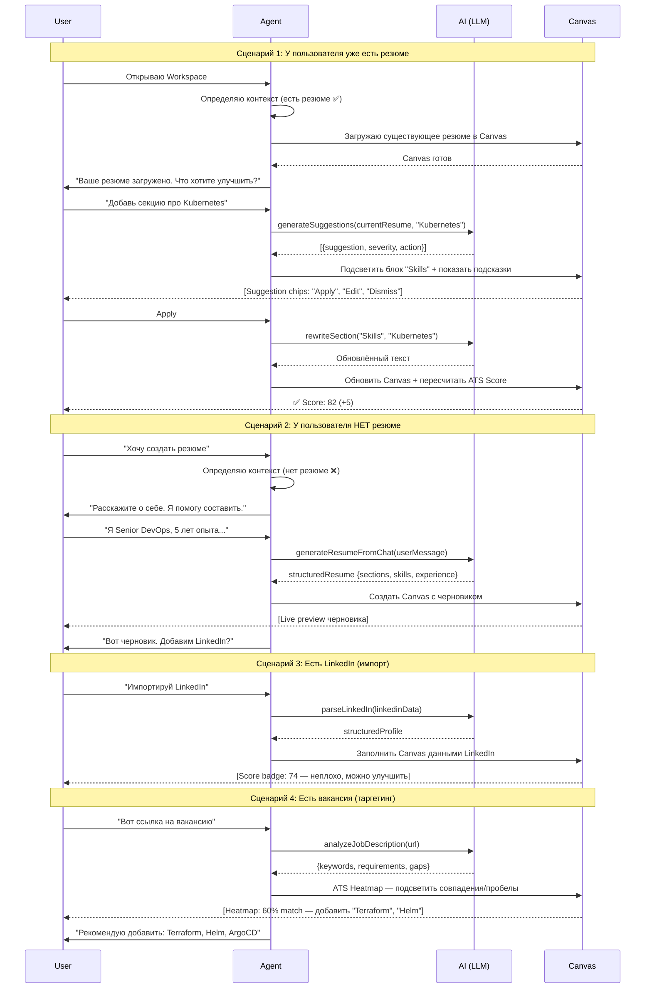

# 01 — Agent Flow: AI-first Workspace

> **Цель:** Объединить разрозненные маршруты `/create` и `/update` в единый AI-first Workspace, где пользователь взаимодействует с агентом, а агент — с AI и Canvas.

---

## 1. Общая архитектура

```
┌─────────────────────────────────────────────────────────┐
│                   AI-first Workspace                     │
│                                                          │
│  ┌──────────┐   ┌──────────┐   ┌────────────────────┐   │
│  │  User    │──▶│  Agent   │──▶│  AI (LLM)          │   │
│  │  Chat    │   │  Router  │   │  • Summarize       │   │
│  │  Input   │   │  Tone    │   │  • Suggest         │   │
│  └──────────┘   │  Adapter │   │  • Parse LinkedIn  │   │
│                 └────┬─────┘   │  • Score ATS       │   │
│                      │         └──────────┬─────────┘   │
│                      │                    │             │
│                      ▼                    ▼             │
│                 ┌──────────────────────────────────┐     │
│                 │           Canvas                  │     │
│                 │  • Live Preview                  │     │
│                 │  • Clickable Blocks              │     │
│                 │  • ATS Heatmap                   │     │
│                 │  • Score Badge                   │     │
│                 └──────────────────────────────────┘     │
└─────────────────────────────────────────────────────────┘
```

---

## 2. Mermaid Sequence Diagram



---

## 3. Адаптация тона агента

Агент определяет тон на основе профиля пользователя или явного выбора.

| Роль пользователя | Тон | Пример |
|---|---|---|
| **Senior** (Lead, Architect) | Metric-oriented, direct | "Ваш ATS Score: 78. Добавление quantifiable metrics поднимет его до 88. Предлагаю 3 варианта." |
| **Junior** (Trainee, Junior) | Supportive, guiding | "Отличный старт! Давай добавим пару ключевых навыков. Вот пример, как описать твой опыт." |
| **Non-tech** (Manager, HR) | Simple, encouraging | "Всё выглядит хорошо! Я помогу сделать резюме понятным для рекрутеров. Нажмите 'Улучшить'." |

**Механизм определения тона:**

```typescript
type AgentTone = 'senior' | 'junior' | 'non-tech';

function detectTone(userProfile: UserProfile): AgentTone {
  if (userProfile.role?.match(/senior|lead|architect|head|principal/i)) return 'senior';
  if (userProfile.role?.match(/junior|trainee|intern|student/i)) return 'junior';
  if (!userProfile.role || userProfile.role.match(/manager|hr|director/i)) return 'non-tech';
  return 'senior'; // fallback
}
```

---

## 4. Интерактивные элементы

### 4.1 Text Input
- Многострочное поле ввода в нижней части Workspace
- Placeholder адаптируется под тон: *"Опишите изменение..."* / *"Что будем улучшать?"* / *"Напишите, что хотите добавить"*
- Отправка по Enter (Shift+Enter — новая строка)

### 4.2 Microphone
- Кнопка 🎤 рядом с полем ввода
- Speech-to-text через Web Speech API или Whisper
- После распознавания текст попадает в input и отправляется

### 4.3 Quick Action Buttons
Набор предустановленных действий над полем ввода:

```
[📄 Импорт LinkedIn] [🎯 Подогнать под вакансию] [✨ Улучшить ATS] [📊 Анализ]
```

### 4.4 Suggestion Chips
После ответа AI — кликабельные чипы под сообщением агента:

```
[Apply] [Edit] [Dismiss] [Show alternatives]
```

---

## 5. Canvas компоненты

### 5.1 Live Preview
- Рендеринг резюме в реальном времени
- Обновляется при каждом Apply от пользователя
- Поддерживает zoom (80%–150%)

### 5.2 Clickable Blocks
- Каждая секция резюме (Summary, Experience, Skills, Education) — отдельный блок
- Клик по блоку открывает inline-редактор
- AI подсвечивает блоки, которые можно улучшить (голубая рамка)

### 5.3 ATS Heatmap
- Цветовая карта совпадения с целевой вакансией
- Зелёный — совпадает, жёлтый — частично, красный — отсутствует

```
┌─────────────────────────────────┐
│  Summary          ████████░░ 80% │
│  Experience       ██████░░░░ 60% │
│  Skills           ████░░░░░░ 40% │ ← красный
│  Education        ██████████ 100% │
└─────────────────────────────────┘
```

### 5.4 Score Badge
- Круглый бейдж в правом верхнем углу Canvas
- Цвет: красный (<60), жёлтый (60–79), зелёный (80+)
- Анимированное изменение при пересчёте

```
┌─────┐
│  78 │  ← ATS Score
│  ▲  │  ← анимация +2
└─────┘
```

---

## 6. State Machine

```
[Idle] ──open──▶ [Loading Resume] ──loaded──▶ [Ready]
  │                                              │
  │                                              ├──user types──▶ [Chatting] ──ai responds──▶ [Suggesting]
  │                                              │                    │                        │
  │                                              │                    └──apply──▶ [Updating] ──▶ [Ready]
  │                                              │                               │
  │                                              └──import linkedin──▶ [Importing] ──▶ [Ready]
  │                                              │
  │                                              └──analyze job──▶ [Analyzing] ──▶ [Ready]
  │
  └──no resume──▶ [Onboarding] ──chat──▶ [Generating Draft] ──▶ [Ready]
```

---

## 7. API Route

```typescript
// POST /api/workspace/init
interface InitWorkspaceRequest {
  userId: string;
  resumeId?: string;       // если есть существующее резюме
  linkedinUrl?: string;    // опционально
  jobUrl?: string;         // опционально
  tone?: AgentTone;        // auto-detect или явно
}

interface InitWorkspaceResponse {
  sessionId: string;
  canvasState: CanvasState;
  agentMessage: string;
  suggestions?: Suggestion[];
}
```
