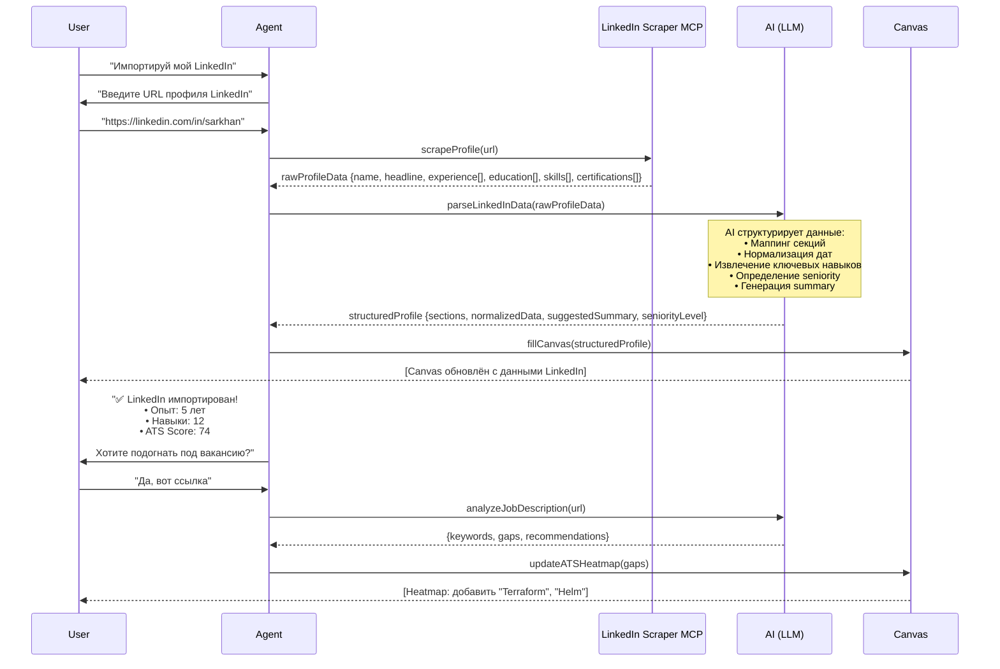

# 02 — LinkedIn Integration

> **Цель:** Импорт профиля LinkedIn через `linkedin-scraper` MCP, парсинг и структурирование данных через AI, заполнение Canvas.

---

## 1. Flow

```
┌──────────┐     ┌──────────┐     ┌──────────────────┐     ┌──────┐     ┌────────┐
│  User    │────▶│  Agent   │────▶│ LinkedIn Scraper  │────▶│ AI   │────▶│ Canvas │
│          │     │          │     │ MCP               │     │      │     │        │
└──────────┘     └──────────┘     └──────────────────┘     └──────┘     └────────┘
```

---

## 2. Mermaid Sequence Diagram



---

## 3. API Route

### POST /api/import-linkedin

```typescript
// api/import-linkedin.ts
import { NextRequest, NextResponse } from 'next/server';
import { scrapeLinkedInProfile } from '@/lib/linkedin-scraper';
import { parseProfileWithAI } from '@/lib/ai/parse-linkedin';
import { updateCanvas } from '@/lib/canvas';

export async function POST(req: NextRequest) {
  const { linkedinUrl, sessionId } = await req.json();

  if (!linkedinUrl) {
    return NextResponse.json(
      { error: 'linkedinUrl is required' },
      { status: 400 }
    );
  }

  try {
    // Шаг 1: Скрапинг LinkedIn
    const rawData = await scrapeLinkedInProfile(linkedinUrl);

    // Шаг 2: Парсинг через AI
    const structured = await parseProfileWithAI(rawData);

    // Шаг 3: Обновление Canvas
    const canvasState = await updateCanvas(sessionId, {
      sections: structured.sections,
      metadata: {
        source: 'linkedin',
        importedAt: new Date().toISOString(),
        linkedinUrl,
        seniorityLevel: structured.seniorityLevel,
      },
    });

    return NextResponse.json({
      success: true,
      profile: {
        name: structured.name,
        headline: structured.headline,
        experienceCount: structured.experience.length,
        skillCount: structured.skills.length,
        seniorityLevel: structured.seniorityLevel,
        suggestedSummary: structured.suggestedSummary,
      },
      canvasState,
      atsScore: canvasState.atsScore,
    });
  } catch (error) {
    console.error('LinkedIn import failed:', error);
    return NextResponse.json(
      { error: 'Failed to import LinkedIn profile' },
      { status: 500 }
    );
  }
}
```

---

## 4. Парсинг и структурирование через AI

### 4.1 Raw Data (от MCP)

```typescript
interface RawLinkedInProfile {
  name: string;
  headline: string;
  location?: string;
  about?: string;
  experience: RawExperience[];
  education: RawEducation[];
  skills: string[];
  certifications: RawCertification[];
  languages?: string[];
  recommendations?: RawRecommendation[];
}

interface RawExperience {
  title: string;
  company: string;
  dateRange: string;       // "Jan 2020 - Present"
  description?: string;
  location?: string;
}
```

### 4.2 Structured Data (после AI)

```typescript
interface StructuredProfile {
  name: string;
  headline: string;
  seniorityLevel: 'junior' | 'mid' | 'senior' | 'lead' | 'executive';
  suggestedSummary: string;
  
  sections: ResumeSection[];
  
  experience: NormalizedExperience[];
  education: NormalizedEducation[];
  skills: NormalizedSkill[];
  certifications: NormalizedCertification[];
  
  metadata: {
    source: 'linkedin';
    importedAt: string;
    linkedinUrl: string;
  };
}

interface NormalizedExperience {
  title: string;
  company: string;
  startDate: string;       // ISO date
  endDate: string | null;  // null = Present
  duration: string;         // "2 yrs 3 mos"
  description: string;      // AI-enhanced
  achievements: string[];   // AI-extracted
  skills: string[];         // relevant skills per role
}

interface NormalizedSkill {
  name: string;
  endorsements?: number;
  category: 'technical' | 'soft' | 'domain';
  relevance: number;        // 0-1, AI-оценка релевантности
}
```

### 4.3 AI Prompt Template

```typescript
const PARSE_LINKEDIN_PROMPT = `
Ты — AI-ассистент для создания резюме. Проанализируй сырые данные LinkedIn профиля и верни структурированный JSON.

Правила:
1. Нормализуй даты в ISO формат
2. Рассчитай duration для каждого опыта
3. Извлеки achievements из description (bullet points)
4. Определи seniorityLevel на основе заголовков и лет опыта
5. Сгенерируй summary (2-3 предложения) на основе headline и about
6. Категоризируй навыки (technical/soft/domain)
7. Оцени relevance каждого навыка (0-1) для IT/CV контекста
8. Если description пустой — сгенерируй правдоподобное описание на основе title и компании

Формат ответа: строгий JSON, соответствующий интерфейсу StructuredProfile.
`;
```

### 4.4 Функция parseProfileWithAI

```typescript
// lib/ai/parse-linkedin.ts
import { OpenAI } from 'openai';

const openai = new OpenAI();

export async function parseProfileWithAI(
  rawData: RawLinkedInProfile
): Promise<StructuredProfile> {
  const response = await openai.chat.completions.create({
    model: 'gpt-4o',
    messages: [
      { role: 'system', content: PARSE_LINKEDIN_PROMPT },
      { role: 'user', content: JSON.stringify(rawData) },
    ],
    response_format: { type: 'json_object' },
  });

  const structured = JSON.parse(
    response.choices[0]?.message?.content || '{}'
  ) as StructuredProfile;

  return structured;
}
```

---

## 5. LinkedIn Scraper MCP

### 5.1 Конфигурация MCP

```json
{
  "mcpServers": {
    "linkedin-scraper": {
      "command": "npx",
      "args": [
        "-y",
        "@anthropic/linkedin-scraper-mcp"
      ],
      "env": {
        "LINKEDIN_EMAIL": "${LINKEDIN_EMAIL}",
        "LINKEDIN_PASSWORD": "${LINKEDIN_PASSWORD}"
      }
    }
  }
}
```

### 5.2 Интеграция через MCP Client

```typescript
// lib/linkedin-scraper.ts
import { Client } from '@modelcontextprotocol/sdk/client/index.js';
import { StdioClientTransport } from '@modelcontextprotocol/sdk/client/stdio.js';

let mcpClient: Client | null = null;

async function getClient(): Promise<Client> {
  if (!mcpClient) {
    const transport = new StdioClientTransport({
      command: 'npx',
      args: ['-y', '@anthropic/linkedin-scraper-mcp'],
      env: {
        LINKEDIN_EMAIL: process.env.LINKEDIN_EMAIL!,
        LINKEDIN_PASSWORD: process.env.LINKEDIN_PASSWORD!,
      },
    });

    mcpClient = new Client({ name: 'cv-sarkhan-dev' });
    await mcpClient.connect(transport);
  }
  return mcpClient;
}

export async function scrapeLinkedInProfile(
  url: string
): Promise<RawLinkedInProfile> {
  const client = await getClient();
  
  const result = await client.callTool({
    name: 'scrape_profile',
    arguments: { url },
  });

  return result.content[0] as RawLinkedInProfile;
}
```

---

## 6. Обработка ошибок

| Ситуация | Действие | Сообщение пользователю |
|---|---|---|
| Неверный URL | Валидация на клиенте | "Пожалуйста, введите корректный URL LinkedIn" |
| Профиль не найден | Retry 2 раза, затем fallback | "Не удалось найти профиль. Проверьте видимость профиля." |
| Лимит запросов | Queue + backoff | "Слишком много запросов. Попробуйте через минуту." |
| Нет данных по секции | Пропустить секцию | "Не удалось импортировать сертификаты. Остальные данные загружены." |
| Ошибка AI парсинга | Fallback на raw данные | "Данные импортированы, но некоторые секции могут требовать ручной правки." |
