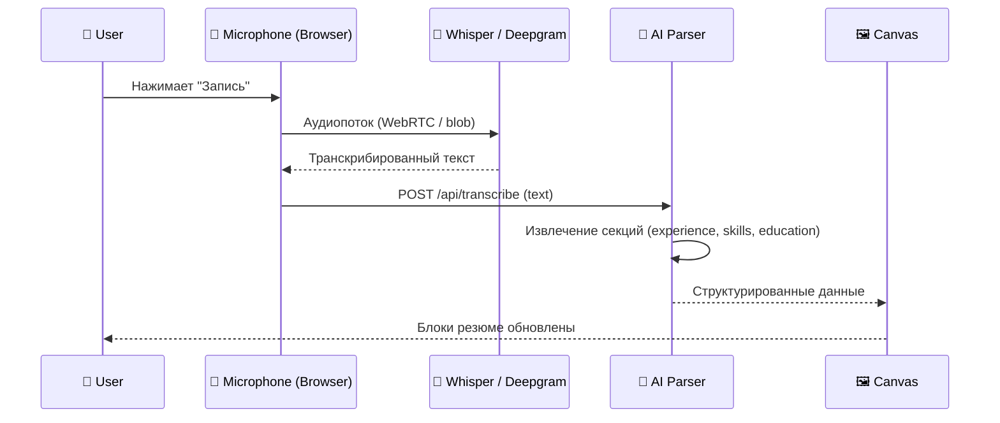

# 04 — Voice Processing: Voice-to-Resume

> **Status:** Draft  
> **Owner:** AI/UX Team  
> **Last Updated:** 2026-07-03

---

## 1. Overview

Voice-to-Resume позволяет пользователю наговаривать свой профессиональный опыт голосом — вместо того чтобы печатать каждую строчку вручную. Голосовой ввод транскрибируется в текст, AI извлекает структурированные секции резюме (опыт, навыки, образование), и результат сразу отображается на холсте.

---

## 2. Flow Diagram



---

## 3. Audio Capture

### 3.1 Browser (Web App)

Используем **Web Audio API** + **MediaRecorder** для захвата микрофона в браузере.

```typescript
// VoiceCapture.ts
export class VoiceCapture {
  private mediaRecorder: MediaRecorder | null = null;
  private chunks: Blob[] = [];

  async startRecording(): Promise<void> {
    const stream = await navigator.mediaDevices.getUserMedia({ audio: true });
    this.mediaRecorder = new MediaRecorder(stream, {
      mimeType: MediaRecorder.isTypeSupported('audio/webm;codecs=opus')
        ? 'audio/webm;codecs=opus'
        : 'audio/webm',
    });

    this.mediaRecorder.ondataavailable = (e) => this.chunks.push(e.data);
    this.mediaRecorder.start();
  }

  stopRecording(): Promise<Blob> {
    return new Promise((resolve) => {
      this.mediaRecorder!.onstop = () => {
        const blob = new Blob(this.chunks, { type: 'audio/webm' });
        this.chunks = [];
        resolve(blob);
      };
      this.mediaRecorder!.stop();
    });
  }
}
```

### 3.2 Telegram Mini App

Telegram Voice Messages приходят как `.ogg` файлы через Bot API. Mini App получает `voice` объект и отправляет его на сервер.

```typescript
// TelegramVoiceHandler.ts
interface TelegramVoice {
  file_id: string;
  duration: number;
  mime_type: string;
}

async function handleTelegramVoice(voice: TelegramVoice): Promise<void> {
  const formData = new FormData();
  formData.append('file_id', voice.file_id);
  formData.append('source', 'telegram');

  await fetch('/api/transcribe', {
    method: 'POST',
    body: formData,
  });
}
```

---

## 4. Transcription Providers

### 4.1 Deepgram (Primary)

- **Nova-2** модель — лучший баланс скорости/качества
- WebSocket streaming для real-time транскрипции
- Поддержка русского и английского языков
- Диаризация (разные спикеры) — для интервью

### 4.2 Whisper (Fallback)

- Локальный fallback через `whisper.cpp` или OpenAI API
- Используется при недоступности Deepgram
- Модель: `large-v3` для максимального качества

```typescript
// TranscriptionProvider.ts
type Provider = 'deepgram' | 'whisper';

interface TranscriptionResult {
  text: string;
  confidence: number;
  duration: number;
  segments: Array<{
    start: number;
    end: number;
    text: string;
    confidence: number;
  }>;
}

class TranscriptionService {
  private primary: Provider = 'deepgram';
  private fallback: Provider = 'whisper';

  async transcribe(audio: Blob): Promise<TranscriptionResult> {
    try {
      return await this.transcribeWith(this.primary, audio);
    } catch (err) {
      console.warn(`Primary provider failed: ${err}`);
      return await this.transcribeWith(this.fallback, audio);
    }
  }

  private async transcribeWith(
    provider: Provider,
    audio: Blob
  ): Promise<TranscriptionResult> {
    const endpoint =
      provider === 'deepgram'
        ? '/api/transcribe/deepgram'
        : '/api/transcribe/whisper';

    const formData = new FormData();
    formData.append('audio', audio);

    const res = await fetch(endpoint, { method: 'POST', body: formData });
    return res.json();
  }
}
```

---

## 5. API Routes

### `POST /api/transcribe`

Принимает аудиофайл, возвращает транскрибированный текст.

**Request:**
```
Content-Type: multipart/form-data
Body: { audio: Blob }
```

**Response:**
```json
{
  "text": "Я работал senior frontend developer в компании X...",
  "confidence": 0.97,
  "segments": [...]
}
```

### `POST /api/extract-from-voice`

Принимает транскрибированный текст, возвращает структурированные секции резюме.

**Request:**
```json
{
  "text": "Я работал senior frontend developer в компании X с 2020 по 2023..."
}
```

**Response:**
```json
{
  "sections": {
    "experience": [
      {
        "title": "Senior Frontend Developer",
        "company": "Компания X",
        "startDate": "2020",
        "endDate": "2023",
        "description": "Разработка интерфейсов..."
      }
    ],
    "skills": ["React", "TypeScript", "Node.js"],
    "education": []
  },
  "raw": "Я работал senior frontend developer..."
}
```

---

## 6. TypeScript Interfaces

```typescript
// VoiceProcessor.ts

interface VoiceProcessor {
  /** Start recording from microphone */
  startRecording(): Promise<void>;
  /** Stop recording and return audio blob */
  stopRecording(): Promise<Blob>;
  /** Transcribe audio blob to text */
  transcribe(audio: Blob): Promise<TranscriptionResult>;
  /** Extract structured resume data from transcribed text */
  extractResumeData(text: string): Promise<ExtractedResumeData>;
  /** Current recording state */
  readonly state: 'idle' | 'recording' | 'processing' | 'done' | 'error';
}

interface ExtractedResumeData {
  sections: {
    experience: ExperienceEntry[];
    skills: string[];
    education: EducationEntry[];
    summary?: string;
  };
  raw: string;
}

interface ExperienceEntry {
  title: string;
  company: string;
  startDate?: string;
  endDate?: string;
  description: string;
}

interface EducationEntry {
  degree: string;
  institution: string;
  year?: string;
}

// VoiceToResumeService.ts

class VoiceToResumeService implements VoiceProcessor {
  private capture: VoiceCapture;
  private transcriber: TranscriptionService;
  private _state: VoiceProcessor['state'] = 'idle';

  get state() {
    return this._state;
  }

  constructor() {
    this.capture = new VoiceCapture();
    this.transcriber = new TranscriptionService();
  }

  async startRecording(): Promise<void> {
    this._state = 'recording';
    await this.capture.startRecording();
  }

  async stopRecording(): Promise<Blob> {
    const blob = await this.capture.stopRecording();
    this._state = 'idle';
    return blob;
  }

  async transcribe(audio: Blob): Promise<TranscriptionResult> {
    this._state = 'processing';
    try {
      const result = await this.transcriber.transcribe(audio);
      this._state = 'done';
      return result;
    } catch (err) {
      this._state = 'error';
      throw err;
    }
  }

  async extractResumeData(text: string): Promise<ExtractedResumeData> {
    this._state = 'processing';
    try {
      const res = await fetch('/api/extract-from-voice', {
        method: 'POST',
        headers: { 'Content-Type': 'application/json' },
        body: JSON.stringify({ text }),
      });
      const data = await res.json();
      this._state = 'done';
      return data;
    } catch (err) {
      this._state = 'error';
      throw err;
    }
  }
}
```

---

## 7. Error Handling

| Scenario | Behaviour |
|---|---|
| Microphone denied | Показать fallback — текстовый ввод |
| Deepgram timeout | Авто-переключение на Whisper |
| Low confidence (< 0.6) | Запросить подтверждение у пользователя |
| Empty transcription | Предложить повторить запись |
| Network error | Retry 3x с exponential backoff |

---

## 8. UX Considerations

- **Push-to-talk** кнопка с визуализацией уровня звука
- **VAD** (Voice Activity Detection) — автоматическая остановка записи при тишине >2с
- **Partial results** — показывать транскрипцию в реальном времени
- **Undo** — возможность отменить последнюю голосовую вставку
- **Language detection** — автоопределение языка (ru/en)
