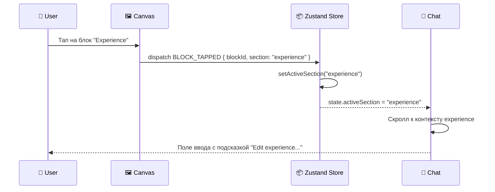
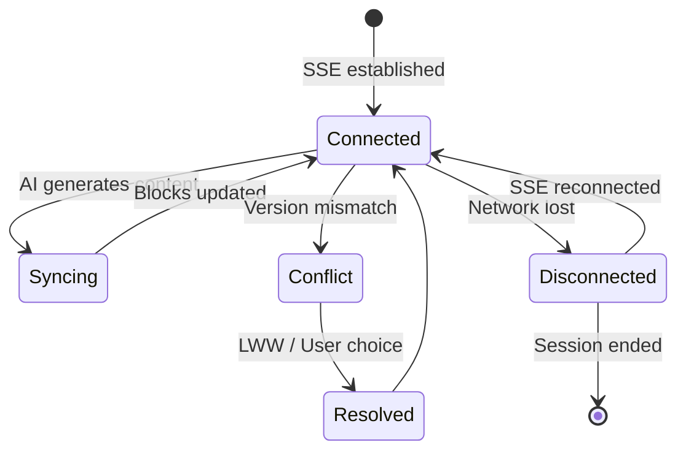

# 05 — Canvas Sync Protocol

> **Status:** Draft  
> **Owner:** AI/UX Team  
> **Last Updated:** 2026-07-03

---

## 1. Overview

Canvas Sync Protocol определяет, как чат (Conversational UI) и холст (Canvas) остаются синхронизированными в реальном времени. Когда AI генерирует изменения резюме, они должны мгновенно отражаться на холсте. Когда пользователь тапает на блок холста, чат должен сфокусироваться на соответствующем контексте.

Архитектура — **event-driven**, с Zustand store как единым источником истины.

---

## 2. Event Types

```typescript
// events.ts

// ── Canvas Events ──────────────────────────────────
type CanvasEvent =
  | { type: 'BLOCK_TAPPED'; blockId: string; section: string }
  | { type: 'BLOCK_DRAGGED'; blockId: string; x: number; y: number }
  | { type: 'BLOCK_RESIZED'; blockId: string; width: number; height: number }
  | { type: 'BLOCK_DELETED'; blockId: string }
  | { type: 'SECTION_REORDERED'; section: string; fromIndex: number; toIndex: number }
  | { type: 'CANVAS_ZOOM_CHANGED'; zoom: number };

// ── Chat Events ──────────────────────────────────────
type ChatEvent =
  | { type: 'AI_SUGGESTION'; suggestionId: string; section: string; content: unknown }
  | { type: 'AI_APPLIED'; suggestionId: string }
  | { type: 'AI_REJECTED'; suggestionId: string }
  | { type: 'USER_MESSAGE'; messageId: string; text: string }
  | { type: 'UNDO'; targetId?: string }
  | { type: 'REDO' };

// ── Sync Events (bridge between chat & canvas) ─────
type SyncEvent =
  | { type: 'FOCUS_CHAT'; section: string; blockId: string }
  | { type: 'FOCUS_CANVAS'; section: string }
  | { type: 'CANVAS_UPDATED'; blocks: ResumeBlock[] }
  | { type: 'CHAT_UPDATED'; history: ChatMessage[] };
```

---

## 3. Zustand Store

```typescript
// store.ts
import { create } from 'zustand';
import { devtools, persist } from 'zustand/middleware';

interface ResumeBlock {
  id: string;
  section: string;
  type: 'experience' | 'skill' | 'education' | 'summary';
  content: Record<string, unknown>;
  order: number;
  version: number;
}

interface ResumeState {
  // ── Data ──
  blocks: ResumeBlock[];
  activeSection: string | null;
  history: ResumeBlock[][];
  historyIndex: number;

  // ── Actions ──
  updateSection: (section: string, data: Partial<ResumeBlock>) => void;
  setActiveSection: (section: string | null) => void;
  applySuggestion: (suggestionId: string, blocks: ResumeBlock[]) => void;
  undoLastChange: () => void;
  redoLastChange: () => void;
  pushHistory: () => void;
}

export const useResumeStore = create<ResumeState>()(
  devtools(
    persist(
      (set, get) => ({
        blocks: [],
        activeSection: null,
        history: [[]],
        historyIndex: 0,

        updateSection: (section, data) => {
          const state = get();
          state.pushHistory();

          set({
            blocks: state.blocks.map((b) =>
              b.section === section ? { ...b, ...data, version: b.version + 1 } : b
            ),
          });
        },

        setActiveSection: (section) => {
          set({ activeSection: section });
        },

        applySuggestion: (suggestionId, newBlocks) => {
          const state = get();
          state.pushHistory();

          // Merge new blocks, keeping existing ones not in the suggestion
          const existingIds = new Set(newBlocks.map((b) => b.id));
          const kept = state.blocks.filter((b) => !existingIds.has(b.id));

          set({
            blocks: [...kept, ...newBlocks],
          });
        },

        undoLastChange: () => {
          const { historyIndex, history } = get();
          if (historyIndex > 0) {
            const newIndex = historyIndex - 1;
            set({
              blocks: history[newIndex],
              historyIndex: newIndex,
            });
          }
        },

        redoLastChange: () => {
          const { historyIndex, history } = get();
          if (historyIndex < history.length - 1) {
            const newIndex = historyIndex + 1;
            set({
              blocks: history[newIndex],
              historyIndex: newIndex,
            });
          }
        },

        pushHistory: () => {
          const { blocks, history, historyIndex } = get();
          const newHistory = history.slice(0, historyIndex + 1);
          newHistory.push([...blocks]);
          // Keep max 50 history entries
          if (newHistory.length > 50) newHistory.shift();
          set({ history: newHistory, historyIndex: newHistory.length - 1 });
        },
      }),
      { name: 'resume-store' }
    )
  )
);
```

---

## 4. Server-Sent Events (SSE) for AI Streaming

Когда AI генерирует контент для холста, используем SSE для стриминга обновлений в реальном времени.

```typescript
// sse.ts
class CanvasSSEService {
  private eventSource: EventSource | null = null;

  connect(sessionId: string): void {
    this.eventSource = new EventSource(`/api/sse/canvas?session=${sessionId}`);

    this.eventSource.addEventListener('block-update', (e) => {
      const data = JSON.parse(e.data) as SyncEvent;
      useResumeStore.getState().applySuggestion(data.suggestionId, data.blocks);
    });

    this.eventSource.addEventListener('focus-chat', (e) => {
      const data = JSON.parse(e.data);
      // Trigger chat focus
      window.dispatchEvent(new CustomEvent('focus-chat', { detail: data }));
    });

    this.eventSource.onerror = () => {
      console.warn('SSE connection lost, retrying...');
      // Auto-reconnect handled by EventSource API
    };
  }

  disconnect(): void {
    this.eventSource?.close();
    this.eventSource = null;
  }
}
```

**Server-side (Next.js API Route):**

```typescript
// app/api/sse/canvas/route.ts
export async function GET(req: Request) {
  const { searchParams } = new URL(req.url);
  const sessionId = searchParams.get('session');

  const stream = new ReadableStream({
    start(controller) {
      // Register this connection
      sseConnections.set(sessionId, controller);

      req.signal.addEventListener('abort', () => {
        sseConnections.delete(sessionId);
      });
    },
  });

  return new Response(stream, {
    headers: {
      'Content-Type': 'text/event-stream',
      'Cache-Control': 'no-cache',
      Connection: 'keep-alive',
    },
  });
}
```

---

## 5. Micro-interaction: Tap Block → Focus Chat



**Implementation:**

```typescript
// CanvasBlock.tsx
function CanvasBlock({ block }: { block: ResumeBlock }) {
  const setActiveSection = useResumeStore((s) => s.setActiveSection);

  const handleTap = () => {
    setActiveSection(block.section);
    window.dispatchEvent(
      new CustomEvent('focus-chat', {
        detail: { section: block.section, blockId: block.id },
      })
    );
  };

  return (
    <div
      className="canvas-block"
      onClick={handleTap}
      role="button"
      tabIndex={0}
      onKeyDown={(e) => e.key === 'Enter' && handleTap()}
    >
      {/* block content */}
    </div>
  );
}
```

```typescript
// ChatPanel.tsx
useEffect(() => {
  const handler = (e: CustomEvent) => {
    const { section } = e.detail;
    // Scroll chat to the relevant section context
    const el = document.getElementById(`chat-section-${section}`);
    el?.scrollIntoView({ behavior: 'smooth' });
    // Set input placeholder
    setInputPlaceholder(`Edit ${section}...`);
  };

  window.addEventListener('focus-chat', handler as EventListener);
  return () => window.removeEventListener('focus-chat', handler as EventListener);
}, []);
```

---

## 6. Conflict Resolution

### 6.1 Optimistic Locking

Каждый блок имеет `version` номер. При обновлении сервер проверяет версию.

```typescript
// Server-side conflict check
async function updateBlock(blockId: string, data: Partial<ResumeBlock>, expectedVersion: number) {
  const current = await db.getBlock(blockId);

  if (current.version !== expectedVersion) {
    throw new ConflictError(
      `Block ${blockId} was modified by another session. Expected version ${expectedVersion}, got ${current.version}`
    );
  }

  return db.updateBlock(blockId, { ...data, version: current.version + 1 });
}
```

### 6.2 Last-Write-Wins (LWW)

Для non-critical полей (позиция, размер) используем LWW:

```typescript
// LWW merge
function mergeBlockPositions(local: ResumeBlock[], remote: ResumeBlock[]): ResumeBlock[] {
  const merged = new Map<string, ResumeBlock>();

  for (const block of [...local, ...remote]) {
    const existing = merged.get(block.id);
    if (!existing || block.version >= existing.version) {
      merged.set(block.id, block);
    }
  }

  return Array.from(merged.values());
}
```

### 6.3 Merge Strategy

| Scenario | Strategy |
|---|---|
| Один пользователь редактирует | Optimistic Locking |
| Два пользователя, разные секции | LWW (no conflict) |
| Два пользователя, одна секция | Optimistic Locking + UI notification |
| AI + User одновременно | AI changes queued, user changes win |
| Offline → Online | LWW + version check |

---

## 7. Sync Lifecycle



---

## 8. Performance Considerations

- **Debounce** canvas position updates (300ms)
- **Batch** SSE events when multiple blocks change
- **Virtual list** for large resumes (50+ blocks)
- **Local cache** via Zustand persist (IndexedDB)
- **Delta updates** — send only changed fields, not full blocks
