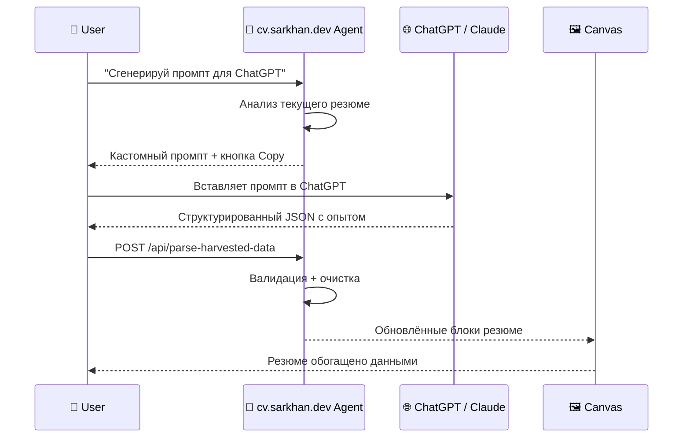

# 06 — AI Prompt Harvester

> **Status:** Draft  
> **Owner:** AI/UX Team  
> **Last Updated:** 2026-07-03

---

## 1. Overview

**AI Prompt Harvester** — killer feature платформы cv.sarkhan.dev. Пользователь может сгенерировать кастомный промпт для ChatGPT или Claude, скопировать его, вставить в диалог с внешним AI, получить структурированные данные о своём опыте, и импортировать их обратно в резюме на холсте.

Это превращает ChatGPT/Claude из конкурента в **источник данных** для платформы.

---

## 2. Flow Diagram



---

## 3. Prompt Generation

### 3.1 ChatGPT Prompt

```markdown
# Role
You are a professional resume consultant and data extraction specialist.

# Task
Analyze the user's professional experience and return a structured JSON object.

# Context
The user is building their CV/resume. They need help articulating their experience in a structured format.

# Instructions
1. Ask the user about their current role, past positions, skills, and education.
2. After gathering enough information, return ONLY a valid JSON object (no markdown, no explanation).
3. If the user provides incomplete information, make reasonable inferences based on the context.

# Output Format
{
  "summary": "string (2-3 sentences)",
  "experience": [
    {
      "title": "string",
      "company": "string",
      "startDate": "YYYY-MM or YYYY",
      "endDate": "YYYY-MM or YYYY or \"Present\"",
      "description": "string (3-5 bullet points)",
      "technologies": ["string"]
    }
  ],
  "skills": [
    {
      "name": "string",
      "level": "beginner | intermediate | advanced | expert",
      "yearsOfExperience": number
    }
  ],
  "education": [
    {
      "degree": "string",
      "institution": "string",
      "year": number,
      "field": "string"
    }
  ],
  "languages": [
    {
      "language": "string",
      "level": "native | fluent | advanced | intermediate | basic"
    }
  ]
}

# Constraints
- Do NOT include any text outside the JSON block
- Do NOT fabricate information — if unsure, use null
- Use ISO date formats where possible
- Keep descriptions concise but impactful
```

### 3.2 Claude Prompt

```markdown
You are a resume data extraction assistant.

Your task is to help the user structure their professional experience into a clean JSON format.

First, ask 3-4 targeted questions about their career:
1. What is your current/most recent role and company?
2. What key technologies do you work with?
3. What are your top 3 career achievements?
4. What is your educational background?

After the user responds, output ONLY this JSON structure with their information:

{
  "summary": "...",
  "experience": [
    { "title": "...", "company": "...", "startDate": "...", "endDate": "...", "description": "...", "technologies": [...] }
  ],
  "skills": [ { "name": "...", "level": "...", "yearsOfExperience": 0 } ],
  "education": [ { "degree": "...", "institution": "...", "year": 0, "field": "..." } ],
  "languages": [ { "language": "...", "level": "..." } ]
}

Rules:
- Output pure JSON only — no markdown fences, no commentary
- Never fabricate data; use null for unknowns
- Be thorough but concise in descriptions
```

---

## 4. API Routes

### `POST /api/generate-harvester-prompt`

Генерирует кастомный промпт на основе текущего состояния резюме пользователя.

**Request:**
```json
{
  "target": "chatgpt" | "claude",
  "currentResume": {
    "sections": ["experience", "skills", "education"],
    "existingData": {}
  }
}
```

**Response:**
```json
{
  "prompt": "You are a professional resume consultant...",
  "instructions": "Copy this prompt and paste it into ChatGPT. Answer the questions, then paste the JSON result back here.",
  "format": "markdown",
  "estimatedTokens": 450
}
```

### `POST /api/parse-harvested-data`

Принимает JSON от внешнего AI, валидирует, очищает от галлюцинаций, возвращает структурированные секции.

**Request:**
```json
{
  "rawData": "{ \"summary\": \"...\", \"experience\": [...] }",
  "source": "chatgpt" | "claude"
}
```

**Response:**
```json
{
  "valid": true,
  "sections": {
    "summary": "...",
    "experience": [...],
    "skills": [...],
    "education": [...],
    "languages": [...]
  },
  "warnings": [
    "Field 'yearsOfExperience' for 'React' was adjusted from 10 to 5 (exceeds plausible range)",
    "Company name 'Google LLC' normalized to 'Google'"
  ],
  "hallucinations": [
    {
      "field": "experience[2].company",
      "original": "FakeCorp Inc",
      "reason": "Company not found in any known database"
    }
  ]
}
```

---

## 5. Validation & Hallucination Cleaning

### 5.1 Schema Validation

```typescript
// validation.ts
import { z } from 'zod';

const ExperienceSchema = z.object({
  title: z.string().min(1).max(200),
  company: z.string().min(1).max(200),
  startDate: z.string().regex(/^\d{4}(-\d{2})?$/).nullable(),
  endDate: z.string().regex(/^\d{4}(-\d{2})?$|^Present$/).nullable(),
  description: z.string().min(10).max(2000),
  technologies: z.array(z.string()).default([]),
});

const SkillSchema = z.object({
  name: z.string().min(1).max(100),
  level: z.enum(['beginner', 'intermediate', 'advanced', 'expert']),
  yearsOfExperience: z.number().min(0).max(50),
});

const ResumeDataSchema = z.object({
  summary: z.string().max(500).nullable(),
  experience: z.array(ExperienceSchema).default([]),
  skills: z.array(SkillSchema).default([]),
  education: z
    .array(
      z.object({
        degree: z.string().min(1),
        institution: z.string().min(1),
        year: z.number().int().min(1950).max(2030),
        field: z.string().nullable(),
      })
    )
    .default([]),
  languages: z
    .array(
      z.object({
        language: z.string().min(1),
        level: z.enum(['native', 'fluent', 'advanced', 'intermediate', 'basic']),
      })
    )
    .default([]),
});
```

### 5.2 Hallucination Detection

```typescript
// hallucination-detector.ts
class HallucinationDetector {
  private knownCompanies = new Set([
    'google', 'meta', 'apple', 'amazon', 'microsoft',
    'yandex', 'sberbank', 'tinkoff', 'ozon', 'wildberries',
    // ... curated list of known companies
  ]);

  private knownTechnologies = new Set([
    'react', 'typescript', 'python', 'go', 'rust',
    'kubernetes', 'docker', 'aws', 'gcp', 'azure',
    // ... curated list of known technologies
  ]);

  detect(data: ParsedResumeData): Hallucination[] {
    const hallucinations: Hallucination[] = [];

    for (const [i, exp] of data.experience.entries()) {
      // Check company plausibility
      if (exp.company && !this.isKnownCompany(exp.company)) {
        hallucinations.push({
          field: `experience[${i}].company`,
          original: exp.company,
          reason: 'Company not found in known database',
        });
      }

      // Check date consistency
      if (exp.startDate && exp.endDate && exp.endDate !== 'Present') {
        if (new Date(exp.endDate) < new Date(exp.startDate)) {
          hallucinations.push({
            field: `experience[${i}].endDate`,
            original: exp.endDate,
            reason: 'End date precedes start date',
          });
        }
      }

      // Check technology plausibility
      for (const tech of exp.technologies) {
        if (!this.isKnownTechnology(tech)) {
          hallucinations.push({
            field: `experience[${i}].technologies`,
            original: tech,
            reason: 'Unknown technology',
          });
        }
      }
    }

    // Check skill years plausibility
    for (const [i, skill] of data.skills.entries()) {
      const maxPlausibleYears = this.getMaxPlausibleYears(skill.name);
      if (skill.yearsOfExperience > maxPlausibleYears) {
        hallucinations.push({
          field: `skills[${i}].yearsOfExperience`,
          original: String(skill.yearsOfExperience),
          reason: `Adjusted from ${skill.yearsOfExperience} to ${maxPlausibleYears} (exceeds plausible range)`,
        });
      }
    }

    return hallucinations;
  }

  private isKnownCompany(name: string): boolean {
    return this.knownCompanies.has(name.toLowerCase().trim());
  }

  private isKnownTechnology(name: string): boolean {
    return this.knownTechnologies.has(name.toLowerCase().trim());
  }

  private getMaxPlausibleYears(tech: string): number {
    // JavaScript — max ~30 years, React — max ~15 years, etc.
    const ageMap: Record<string, number> = {
      react: 15, vue: 10, angular: 15, python: 35,
      typescript: 15, go: 15, rust: 10,
    };
    return ageMap[tech.toLowerCase()] ?? 20;
  }
}
```

### 5.3 Auto-Correction

```typescript
// auto-correct.ts
class AutoCorrector {
  private corrections: Record<string, string> = {
    'Figma': 'Figma',
    'Figma (design tool)': 'Figma',
    'Typescript': 'TypeScript',
    'Javascript': 'JavaScript',
    'React.js': 'React',
    'Node.js': 'Node.js',
    'NodeJS': 'Node.js',
    'Postgresql': 'PostgreSQL',
    'Mongodb': 'MongoDB',
    'K8s': 'Kubernetes',
  };

  correct(data: ParsedResumeData): { data: ParsedResumeData; corrections: Correction[] } {
    const corrections: Correction[] = [];

    for (const exp of data.experience) {
      exp.technologies = exp.technologies.map((tech) => {
        const corrected = this.corrections[tech];
        if (corrected && corrected !== tech) {
          corrections.push({ from: tech, to: corrected });
          return corrected;
        }
        return tech;
      });
    }

    for (const skill of data.skills) {
      const corrected = this.corrections[skill.name];
      if (corrected && corrected !== skill.name) {
        corrections.push({ from: skill.name, to: corrected });
        skill.name = corrected;
      }
    }

    return { data, corrections };
  }
}
```

---

## 6. UI Integration

### 6.1 Harvester Panel

```
┌─────────────────────────────────────┐
│  🤖 AI Prompt Harvester             │
│                                     │
│  Target: [ChatGPT ▼] [Claude]       │
│                                     │
│  ┌─────────────────────────────────┐│
│  │ Copy this prompt and paste it   ││
│  │ into ChatGPT...                 ││
│  │                                 ││
│  │ [📋 Copy] [🔄 Regenerate]       ││
│  └─────────────────────────────────┘│
│                                     │
│  ┌─────────────────────────────────┐│
│  │ Paste harvested JSON here...    ││
│  │                                 ││
│  │ [📤 Import]                     ││
│  └─────────────────────────────────┘│
│                                     │
│  Status: ✅ Data imported           │
│  Warnings: 2 minor corrections     │
└─────────────────────────────────────┘
```

### 6.2 React Component

```tsx
// HarvesterPanel.tsx
function HarvesterPanel() {
  const [target, setTarget] = useState<'chatgpt' | 'claude'>('chatgpt');
  const [prompt, setPrompt] = useState('');
  const [rawInput, setRawInput] = useState('');
  const [status, setStatus] = useState<'idle' | 'loading' | 'success' | 'error'>('idle');
  const [warnings, setWarnings] = useState<string[]>([]);

  const generatePrompt = async () => {
    setStatus('loading');
    const res = await fetch('/api/generate-harvester-prompt', {
      method: 'POST',
      headers: { 'Content-Type': 'application/json' },
      body: JSON.stringify({ target }),
    });
    const data = await res.json();
    setPrompt(data.prompt);
    setStatus('idle');
  };

  const importData = async () => {
    setStatus('loading');
    try {
      const res = await fetch('/api/parse-harvested-data', {
        method: 'POST',
        headers: { 'Content-Type': 'application/json' },
        body: JSON.stringify({ rawData: rawInput, source: target }),
      });
      const data = await res.json();

      if (data.valid) {
        useResumeStore.getState().applySuggestion('harvester', data.sections);
        setWarnings(data.warnings || []);
        setStatus('success');
      } else {
        setStatus('error');
      }
    } catch {
      setStatus('error');
    }
  };

  return (
    <div className="harvester-panel">
      <h2>🤖 AI Prompt Harvester</h2>

      <div className="target-selector">
        <button onClick={() => setTarget('chatgpt')} data-active={target === 'chatgpt'}>
          ChatGPT
        </button>
        <button onClick={() => setTarget('claude')} data-active={target === 'claude'}>
          Claude
        </button>
      </div>

      <div className="prompt-box">
        <textarea readOnly value={prompt} placeholder="Click 'Generate' to create a prompt..." />
        <div className="actions">
          <button onClick={() => navigator.clipboard.writeText(prompt)}>📋 Copy</button>
          <button onClick={generatePrompt}>🔄 Generate</button>
        </div>
      </div>

      <div className="import-box">
        <textarea
          value={rawInput}
          onChange={(e) => setRawInput(e.target.value)}
          placeholder="Paste the JSON from ChatGPT/Claude here..."
          rows={6}
        />
        <button onClick={importData} disabled={!rawInput}>
          📤 Import
        </button>
      </div>

      {warnings.length > 0 && (
        <div className="warnings">
          {warnings.map((w, i) => (
            <p key={i}>⚠️ {w}</p>
          ))}
        </div>
      )}

      {status === 'success' && <div className="success">✅ Resume updated successfully!</div>}
      {status === 'error' && <div className="error">❌ Failed to parse data. Check the format.</div>}
    </div>
  );
}
```

---

## 7. Security Considerations

| Concern | Mitigation |
|---|---|
| Prompt injection | Экранирование пользовательского ввода в промптах |
| Data exfiltration | Валидация на сервере — никакой raw data не сохраняется без проверки |
| Hallucinated companies | Чёрный список несуществующих компаний |
| Rate limiting | 10 генераций / 5 импортов в час на пользователя |
| JSON parsing bombs | Ограничение глубины вложенности (max 5 levels) |

---

## 8. Success Metrics

| Metric | Target |
|---|---|
| Prompt copy rate | > 60% of generated prompts are copied |
| Import success rate | > 80% of pasted JSON passes validation |
| Hallucination catch rate | > 95% of fabricated data detected |
| User completion | > 40% of users who start harvester complete the flow |
| Time-to-import | < 2 minutes from prompt generation to data on canvas |
