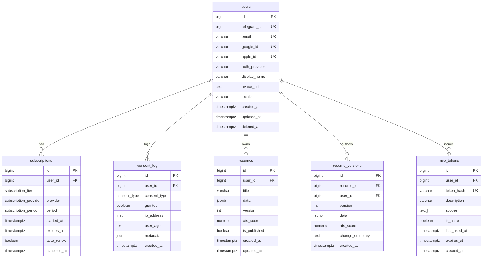

# Database Schema — cv.sarkhan.dev

> Полная SQL схема для хранения данных пользователей, подписок, резюме и consent-логов.

---

## 1. Таблица `users`

Хранит информацию о пользователях, привязанную к Telegram и опциональным OAuth-провайдерам.

```sql
CREATE TABLE users (
    id              BIGSERIAL PRIMARY KEY,
    telegram_id     BIGINT UNIQUE NOT NULL,
    email           VARCHAR(255),
    google_id       VARCHAR(255) UNIQUE,
    apple_id        VARCHAR(255) UNIQUE,
    auth_provider   VARCHAR(20) NOT NULL DEFAULT 'telegram'
                    CHECK (auth_provider IN ('telegram', 'google', 'apple', 'email')),
    display_name    VARCHAR(128),
    avatar_url      TEXT,
    locale          VARCHAR(10) DEFAULT 'ru',
    created_at      TIMESTAMPTZ NOT NULL DEFAULT NOW(),
    updated_at      TIMESTAMPTZ NOT NULL DEFAULT NOW(),
    deleted_at      TIMESTAMPTZ                      -- soft-delete для GDPR
);

-- Индексы
CREATE INDEX idx_users_telegram_id ON users(telegram_id);
CREATE INDEX idx_users_email      ON users(email) WHERE email IS NOT NULL;
CREATE INDEX idx_users_google_id  ON users(google_id) WHERE google_id IS NOT NULL;
CREATE INDEX idx_users_apple_id   ON users(apple_id) WHERE apple_id IS NOT NULL;
CREATE INDEX idx_users_deleted_at ON users(deleted_at) WHERE deleted_at IS NOT NULL;
```

---

## 2. Таблица `subscriptions`

Управление подписками пользователей.

```sql
CREATE TYPE subscription_tier    AS ENUM ('free', 'basic', 'pro', 'enterprise');
CREATE TYPE subscription_provider AS ENUM ('telegram_stars', 'stripe', 'apple_pay', 'google_pay');
CREATE TYPE subscription_period  AS ENUM ('monthly', 'yearly', 'lifetime');

CREATE TABLE subscriptions (
    id              BIGSERIAL PRIMARY KEY,
    user_id         BIGINT NOT NULL REFERENCES users(id) ON DELETE CASCADE,
    tier            subscription_tier NOT NULL DEFAULT 'free',
    provider        subscription_provider,
    period          subscription_period,
    started_at      TIMESTAMPTZ NOT NULL DEFAULT NOW(),
    expires_at      TIMESTAMPTZ,
    auto_renew      BOOLEAN NOT NULL DEFAULT TRUE,
    canceled_at     TIMESTAMPTZ,
    created_at      TIMESTAMPTZ NOT NULL DEFAULT NOW(),
    updated_at      TIMESTAMPTZ NOT NULL DEFAULT NOW(),

    CONSTRAINT chk_expires_after_start CHECK (expires_at IS NULL OR expires_at > started_at)
);

-- Индексы
CREATE INDEX idx_subscriptions_user_id    ON subscriptions(user_id);
CREATE INDEX idx_subscriptions_tier       ON subscriptions(tier);
CREATE INDEX idx_subscriptions_expires    ON subscriptions(expires_at)
    WHERE expires_at IS NOT NULL AND canceled_at IS NULL;
```

---

## 3. Таблица `consent_log`

Неизменяемый (append-only) лог согласий пользователя — основа GDPR-комплаенса.

```sql
CREATE TYPE consent_type AS ENUM (
    'terms_of_service',
    'privacy_policy',
    'data_processing',
    'marketing',
    'analytics',
    'third_party_sharing'
);

CREATE TABLE consent_log (
    id              BIGSERIAL PRIMARY KEY,
    user_id         BIGINT NOT NULL REFERENCES users(id) ON DELETE CASCADE,
    consent_type    consent_type NOT NULL,
    granted         BOOLEAN NOT NULL,
    ip_address      INET,
    user_agent      TEXT,
    metadata        JSONB DEFAULT '{}',
    created_at      TIMESTAMPTZ NOT NULL DEFAULT NOW()
);

-- Индексы
CREATE INDEX idx_consent_log_user_id      ON consent_log(user_id);
CREATE INDEX idx_consent_log_type         ON consent_log(consent_type);
CREATE INDEX idx_consent_log_created_at   ON consent_log(created_at);
CREATE INDEX idx_consent_log_lookup
    ON consent_log(user_id, consent_type, created_at DESC);
```

> **Важно**: `consent_log` — append-only. UPDATE и DELETE запрещены на уровне приложения.
> Отзыв согласия = запись новой строки с `granted = false`.

---

## 4. Таблица `resumes`

Основное хранилище резюме пользователя.

```sql
CREATE TABLE resumes (
    id              BIGSERIAL PRIMARY KEY,
    user_id         BIGINT NOT NULL REFERENCES users(id) ON DELETE CASCADE,
    title           VARCHAR(255) NOT NULL DEFAULT 'Моё резюме',
    data            JSONB NOT NULL,
    version         INTEGER NOT NULL DEFAULT 1,
    ats_score       NUMERIC(5,2)               -- ATS-совместимость 0.00–100.00
                    CHECK (ats_score IS NULL OR (ats_score >= 0 AND ats_score <= 100)),
    is_published    BOOLEAN NOT NULL DEFAULT FALSE,
    created_at      TIMESTAMPTZ NOT NULL DEFAULT NOW(),
    updated_at      TIMESTAMPTZ NOT NULL DEFAULT NOW(),

    CONSTRAINT uq_resumes_user_version UNIQUE (user_id, version)
);

-- Индексы
CREATE INDEX idx_resumes_user_id     ON resumes(user_id);
CREATE INDEX idx_resumes_published   ON resumes(user_id, is_published)
    WHERE is_published = TRUE;
CREATE INDEX idx_resumes_ats_score   ON resumes(ats_score DESC)
    WHERE ats_score IS NOT NULL;
```

---

## 5. Таблица `resume_versions`

Полная история изменений каждого резюме.

```sql
CREATE TABLE resume_versions (
    id              BIGSERIAL PRIMARY KEY,
    resume_id       BIGINT NOT NULL REFERENCES resumes(id) ON DELETE CASCADE,
    user_id         BIGINT NOT NULL REFERENCES users(id) ON DELETE CASCADE,
    version         INTEGER NOT NULL,
    data            JSONB NOT NULL,
    ats_score       NUMERIC(5,2)
                    CHECK (ats_score IS NULL OR (ats_score >= 0 AND ats_score <= 100)),
    change_summary  TEXT,
    created_at      TIMESTAMPTZ NOT NULL DEFAULT NOW(),

    CONSTRAINT uq_resume_versions UNIQUE (resume_id, version)
);

-- Индексы
CREATE INDEX idx_resume_versions_resume_id ON resume_versions(resume_id);
CREATE INDEX idx_resume_versions_user_id   ON resume_versions(user_id);
CREATE INDEX idx_resume_versions_created   ON resume_versions(created_at DESC);
```

---

## 6. Таблица `mcp_tokens`

Токены для MCP-аутентификации внешних сервисов.

```sql
CREATE TABLE mcp_tokens (
    id              BIGSERIAL PRIMARY KEY,
    user_id         BIGINT NOT NULL REFERENCES users(id) ON DELETE CASCADE,
    token_hash      VARCHAR(64) NOT NULL UNIQUE,   -- SHA-256 хеш токена
    description     VARCHAR(255),
    scopes          TEXT[] NOT NULL DEFAULT '{}',
    is_active       BOOLEAN NOT NULL DEFAULT TRUE,
    last_used_at    TIMESTAMPTZ,
    expires_at      TIMESTAMPTZ,
    created_at      TIMESTAMPTZ NOT NULL DEFAULT NOW()
);

-- Индексы
CREATE INDEX idx_mcp_tokens_user_id     ON mcp_tokens(user_id);
CREATE INDEX idx_mcp_tokens_hash        ON mcp_tokens(token_hash);
CREATE INDEX idx_mcp_tokens_active      ON mcp_tokens(user_id, is_active)
    WHERE is_active = TRUE;
```

---

## ER-диаграмма



---

## Сводка индексов производительности

| Таблица | Индекс | Назначение |
|---|---|---|
| `users` | `telegram_id` | Быстрый поиск при входе через Telegram |
| `users` | `email`, `google_id`, `apple_id` | OAuth-привязка |
| `subscriptions` | `user_id + tier` | Фильтрация активных подписок |
| `consent_log` | `(user_id, consent_type, created_at DESC)` | Последний статус согласия |
| `resumes` | `(user_id, is_published)` | Публичные резюме пользователя |
| `resume_versions` | `(resume_id, version)` | Версионирование |
| `mcp_tokens` | `token_hash` | Быстрая валидация токена |
