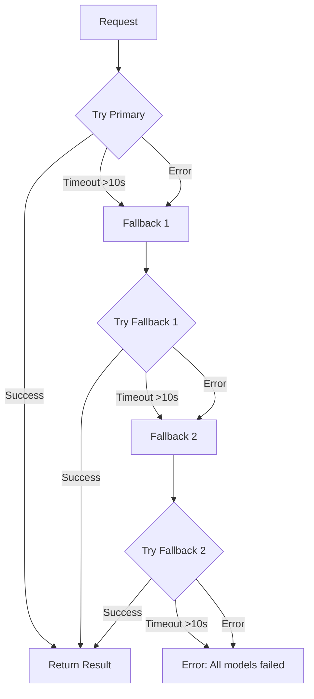

# Fallback Chain

## Flowchart



**Gemini2.5Flash** is the universal fallback for the entire chain — every task falls back to it when the primary model fails.

## TypeScript: `callWithFallback()`

```typescript
// src/ai/fallback.ts

import { MODEL_ROUTES, ModelRoute } from './routing';

interface FallbackOptions {
  task: keyof typeof MODEL_ROUTES;
  payload: unknown;
  timeout?: number; // per-model timeout in ms (default: 30000)
}

interface FallbackResult<T = unknown> {
  data: T;
  model: string;
  attempt: number;
}

export async function callWithFallback<T = unknown>(
  options: FallbackOptions,
): Promise<FallbackResult<T>> {
  const { task, payload, timeout = 30_000 } = options;
  const route: ModelRoute = MODEL_ROUTES[task];
  const models = [route.primary, ...route.fallbacks];

  for (let i = 0; i < models.length; i++) {
    const model = models[i];
    const controller = new AbortController();
    const timer = setTimeout(() => controller.abort(), timeout);

    try {
      const data = await callModel<T>(model, payload, controller.signal);
      return { data, model, attempt: i + 1 };
    } catch (err) {
      console.warn(`[Fallback] Model "${model}" failed:`, err);
      // continue to next fallback
    } finally {
      clearTimeout(timer);
    }
  }

  throw new Error(
    `All models failed for task "${task}": tried [${models.join(', ')}]`,
  );
}

// --- internal ---

async function callModel<T>(
  model: string,
  payload: unknown,
  signal: AbortSignal,
): Promise<T> {
  const response = await fetch('/api/ai/chat', {
    method: 'POST',
    headers: { 'Content-Type': 'application/json' },
    body: JSON.stringify({ model, ...(payload as object) }),
    signal,
  });

  if (!response.ok) {
    throw new Error(`HTTP ${response.status}: ${await response.text()}`);
  }

  return response.json();
}
```
