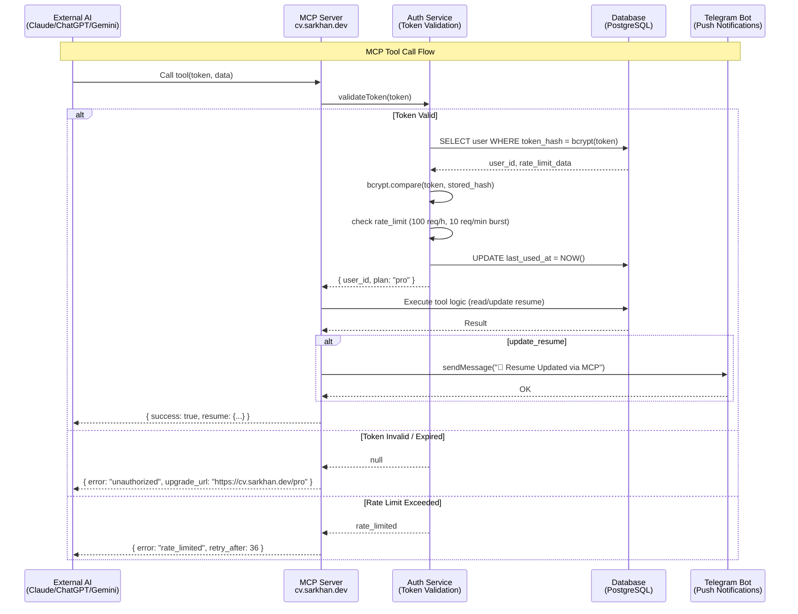

# MCP Server — Security & Authentication

> **Проект:** cv.sarkhan.dev  
> **Назначение:** Безопасность, аутентификация и rate limiting MCP Server

---

## 1. Архитектура безопасности



---

## 2. Pro Token Generation

Токен генерируется при апгрейде до Pro-плана и показывается пользователю **только один раз**.

### Генерация

```typescript
import { randomUUID } from 'crypto';
import bcrypt from 'bcrypt';

const SALT_ROUNDS = 12;

interface ProToken {
  raw: string;       // Показывается пользователю 1 раз
  hash: string;      // Хранится в БД
  prefix: string;    // Первые 8 символов для идентификации (cv_pro_...)
}

async function generateProToken(): Promise<ProToken> {
  const raw = `cv_pro_${randomUUID()}`;  // e.g. cv_pro_550e8400-e29b-41d4-a716-446655440000
  const hash = await bcrypt.hash(raw, SALT_ROUNDS);
  const prefix = raw.substring(0, 16);    // cv_pro_550e8400

  return { raw, hash, prefix };
}
```

### Хранение в БД

```sql
CREATE TABLE pro_tokens (
  id          UUID PRIMARY KEY DEFAULT gen_random_uuid(),
  user_id     UUID NOT NULL REFERENCES users(id) ON DELETE CASCADE,
  token_hash  TEXT NOT NULL,              -- bcrypt hash
  prefix      TEXT NOT NULL UNIQUE,       -- для отображения в UI
  name        TEXT DEFAULT 'default',     -- пользовательская метка
  is_revoked  BOOLEAN DEFAULT FALSE,
  last_used_at TIMESTAMPTZ,
  created_at  TIMESTAMPTZ DEFAULT NOW(),
  expires_at  TIMESTAMPTZ                -- NULL = не истекает
);

CREATE INDEX idx_pro_tokens_user_id ON pro_tokens(user_id);
CREATE INDEX idx_pro_tokens_prefix  ON pro_tokens(prefix);
```

### Правила безопасности токенов

| Правило                          | Описание                                              |
|----------------------------------|-------------------------------------------------------|
| **Shown once**                   | Токен показывается сразу после генерации и не хранится в plaintext |
| **Bcrypt hashed**                | В БД хранится только bcrypt hash (12 rounds)          |
| **Revocable**                    | Пользователь может отозвать токен через UI            |
| **Multiple tokens**              | Можно создать несколько токенов (для разных клиентов)  |
| **Prefix-only in logs**          | В логах пишется только prefix, полный токен никогда   |
| **Expiration**                   | Опциональный срок действия (по умолчанию бессрочно)   |

---

## 3. Token Validation

```typescript
import bcrypt from 'bcrypt';
import { db } from './db';

interface TokenValidationResult {
  valid: boolean;
  user?: { id: string; plan: string };
  error?: 'unauthorized' | 'expired' | 'revoked' | 'rate_limited';
  retryAfter?: number;
}

async function validateToken(rawToken: string): Promise<TokenValidationResult> {
  // 1. Извлекаем prefix для поиска
  const prefix = rawToken.substring(0, 16);

  // 2. Ищем запись по prefix
  const record = await db.query(
    `SELECT id, user_id, token_hash, is_revoked, expires_at, last_used_at
     FROM pro_tokens WHERE prefix = $1`,
    [prefix]
  );

  if (!record) {
    return { valid: false, error: 'unauthorized' };
  }

  // 3. Проверка revoked
  if (record.is_revoked) {
    return { valid: false, error: 'revoked' };
  }

  // 4. Проверка expiration
  if (record.expires_at && new Date() > record.expires_at) {
    return { valid: false, error: 'expired' };
  }

  // 5. bcrypt.compare — основной check
  const match = await bcrypt.compare(rawToken, record.token_hash);
  if (!match) {
    return { valid: false, error: 'unauthorized' };
  }

  // 6. Rate limit check
  const rateResult = await checkRateLimit(record.user_id);
  if (!rateResult.allowed) {
    return { valid: false, error: 'rate_limited', retryAfter: rateResult.retryAfter };
  }

  // 7. Обновляем last_used_at (асинхронно, не блокируем ответ)
  db.query(
    `UPDATE pro_tokens SET last_used_at = NOW() WHERE id = $1`,
    [record.id]
  ).catch(() => {}); // fire-and-forget

  // 8. Получаем пользователя
  const user = await db.query(
    `SELECT id, plan FROM users WHERE id = $1`,
    [record.user_id]
  );

  return { valid: true, user };
}
```

---

## 4. Rate Limiting

### Стратегия: Sliding Window + Burst

| Параметр              | Значение        | Описание                          |
|-----------------------|-----------------|-----------------------------------|
| `MAX_REQUESTS_PER_HOUR` | 100           | Максимум запросов в час на токен  |
| `BURST_PER_MINUTE`      | 10            | Максимум запросов в минуту (burst)|
| `WINDOW_SIZE_MS`        | 3600_000      | Окно в миллисекундах (1 час)      |

### Реализация

```typescript
interface RateLimitResult {
  allowed: boolean;
  remaining: number;
  retryAfter: number;  // секунд до следующего разрешённого запроса
}

async function checkRateLimit(userId: string): Promise<RateLimitResult> {
  const now = Date.now();
  const windowStart = now - 3600_000; // 1 hour ago
  const minuteStart = now - 60_000;   // 1 minute ago

  // Считаем запросы за последний час и минуту
  const [hourlyCount, minuteCount] = await Promise.all([
    db.query(
      `SELECT COUNT(*) as count FROM mcp_logs
       WHERE user_id = $1 AND created_at > $2`,
      [userId, new Date(windowStart).toISOString()]
    ),
    db.query(
      `SELECT COUNT(*) as count FROM mcp_logs
       WHERE user_id = $1 AND created_at > $2`,
      [userId, new Date(minuteStart).toISOString()]
    ),
  ]);

  const hourly = parseInt(hourlyCount.count, 10);
  const minute = parseInt(minuteCount.count, 10);

  if (hourly >= 100) {
    // Когда освободится место в окне
    const oldestInWindow = await db.query(
      `SELECT created_at FROM mcp_logs
       WHERE user_id = $1
       ORDER BY created_at ASC LIMIT 1`,
      [userId]
    );
    const retryAfter = Math.ceil(
      (oldestInWindow.created_at.getTime() + 3600_000 - now) / 1000
    );
    return { allowed: false, remaining: 0, retryAfter };
  }

  if (minute >= 10) {
    const retryAfter = 60 - Math.floor((now - minuteStart) / 1000);
    return { allowed: false, remaining: 0, retryAfter };
  }

  return { allowed: true, remaining: 100 - hourly, retryAfter: 0 };
}
```

### HTTP Headers (для HTTP transport)

```
X-RateLimit-Limit:     100
X-RateLimit-Remaining: 87
X-RateLimit-Reset:     1690000000
```

---

## 5. Аудит и Логирование

Все вызовы MCP инструментов логируются в таблицу `mcp_logs`.

```sql
CREATE TABLE mcp_logs (
  id          UUID PRIMARY KEY DEFAULT gen_random_uuid(),
  user_id     UUID NOT NULL REFERENCES users(id),
  token_prefix TEXT NOT NULL,            -- только prefix, не полный токен
  tool_name   TEXT NOT NULL,             -- update_resume | get_resume | analyze_resume
  input_summary TEXT,                    -- обезличенная сводка входных данных
  ip_address  INET,
  user_agent  TEXT,
  status      TEXT NOT NULL,             -- success | unauthorized | rate_limited | error
  duration_ms INTEGER,
  created_at  TIMESTAMPTZ DEFAULT NOW()
);

CREATE INDEX idx_mcp_logs_user_id    ON mcp_logs(user_id);
CREATE INDEX idx_mcp_logs_created_at ON mcp_logs(created_at);
CREATE INDEX idx_mcp_logs_status     ON mcp_logs(status);
```

### Пример записи

```json
{
  "id": "a1b2c3d4-...",
  "user_id": "user-uuid-here",
  "token_prefix": "cv_pro_550e8400",
  "tool_name": "update_resume",
  "input_summary": "sections: [skills, experience], context: 'Applied to Google'",
  "ip_address": "203.0.113.42",
  "user_agent": "ClaudeDesktop/1.0",
  "status": "success",
  "duration_ms": 342,
  "created_at": "2025-07-03T12:00:00Z"
}
```

---

## 6. Security Headers (HTTP transport)

```typescript
import helmet from 'helmet';

app.use(helmet({
  contentSecurityPolicy: false,  // MCP не использует CSP
  hsts: {
    maxAge: 31536000,
    includeSubDomains: true,
    preload: true,
  },
}));

// Дополнительные заголовки
app.use((req, res, next) => {
  res.setHeader('X-Content-Type-Options', 'nosniff');
  res.setHeader('X-Frame-Options', 'DENY');
  res.setHeader('Cache-Control', 'no-store');
  next();
});
```

---

## 7. Transport Security

| Transport | Security                                      |
|-----------|-----------------------------------------------|
| **STDIO** | Локальный — безопасен по определению           |
| **HTTP**  | Только HTTPS (TLS 1.3), HSTS, заголовки выше  |
| **WebSocket** | WSS, токен в query param или заголовке    |

### HTTPS Enforcement

```typescript
// Express middleware
app.use((req, res, next) => {
  if (req.headers['x-forwarded-proto'] !== 'https' && process.env.NODE_ENV === 'production') {
    return res.status(403).json({ error: 'https_required' });
  }
  next();
});
```

---

## 8. Управление токенами (User API)

### Создать токен

```http
POST /api/pro/tokens
Authorization: Bearer <session_token>
Content-Type: application/json

{
  "name": "Claude Desktop"
}
```

**Response:**

```json
{
  "token": "cv_pro_550e8400-e29b-41d4-a716-446655440000",
  "prefix": "cv_pro_550e8400",
  "name": "Claude Desktop",
  "created_at": "2025-07-03T12:00:00Z",
  "warning": "Save this token now. It will not be shown again."
}
```

### Список токенов

```http
GET /api/pro/tokens
Authorization: Bearer <session_token>
```

**Response:**

```json
{
  "tokens": [
    {
      "prefix": "cv_pro_550e8400",
      "name": "Claude Desktop",
      "last_used_at": "2025-07-03T11:45:00Z",
      "is_revoked": false,
      "created_at": "2025-07-01T10:00:00Z"
    }
  ]
}
```

### Отозвать токен

```http
DELETE /api/pro/tokens/:prefix
Authorization: Bearer <session_token>
```

**Response:** `204 No Content`

---

## 9. Security Checklist

- [x] Токены генерируются через `crypto.randomUUID` (128 бит энтропии)
- [x] Хранятся только bcrypt hash (12 rounds)
- [x] Показываются пользователю один раз
- [x] Возможность отзыва через UI/API
- [x] Rate limiting: 100 req/h + 10 req/min burst
- [x] Все вызовы логируются с prefix (не полный токен)
- [x] Sliding window для rate limit (не календарный час)
- [x] HTTPS только в production
- [x] HSTS preload
- [x] Revoked tokens проверяются при каждом запросе
- [x] Fire-and-forget обновление `last_used_at` (не блокирует ответ)
- [x] Prefix-only в логах и алертах
