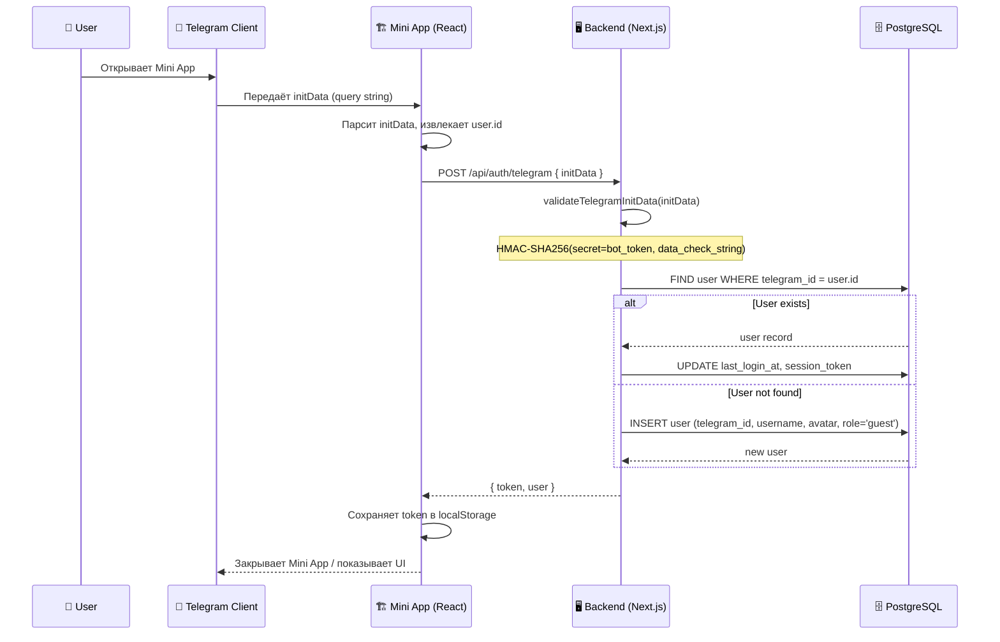

# Telegram Mini App Integration

> **Архитектура**: беспарольный вход через Telegram Mini App, HMAC-SHA256 валидация initData, push-уведомления через Bot API.

---

## 1. Flow авторизации



---

## 2. Валидация initData (TypeScript)

```typescript
// lib/telegram/validate.ts
import crypto from 'node:crypto';

const BOT_TOKEN = process.env.TELEGRAM_BOT_TOKEN!;

interface TelegramInitData {
  auth_date: number;
  hash: string;
  query_id?: string;
  user?: string; // JSON
  [key: string]: string | number | undefined;
}

/**
 * Проверяет подпись initData от Telegram.
 * Алгоритм: HMAC-SHA256(secret=HMAC-SHA256(bot_token, "WebAppData"), data_check_string)
 */
export function validateTelegramInitData(raw: string): TelegramInitData | null {
  const params = new URLSearchParams(raw);
  const hash = params.get('hash');
  if (!hash) return null;

  // Удаляем hash из проверяемых данных
  params.delete('hash');

  // Сортируем ключи по алфавиту и склеиваем key=value через \n
  const dataCheckString = Array.from(params.entries())
    .sort(([a], [b]) => a.localeCompare(b))
    .map(([k, v]) => `${k}=${v}`)
    .join('\n');

  // Секретный ключ: HMAC-SHA256(bot_token, "WebAppData")
  const secretKey = crypto
    .createHmac('sha256', 'WebAppData')
    .update(BOT_TOKEN)
    .digest();

  // Вычисляем ожидаемый hash
  const computedHash = crypto
    .createHmac('sha256', secretKey)
    .update(dataCheckString)
    .digest('hex');

  if (computedHash !== hash) return null;

  // Проверяем, что данные не старше 24 часов
  const authDate = Number(params.get('auth_date') ?? 0);
  const now = Math.floor(Date.now() / 1000);
  if (now - authDate > 86400) return null;

  const result: TelegramInitData = { auth_date, hash };
  for (const [k, v] of params.entries()) {
    result[k] = v;
  }
  return result;
}
```

---

## 3. API Route: POST /api/auth/telegram

```typescript
// app/api/auth/telegram/route.ts
import { NextRequest, NextResponse } from 'next/server';
import { validateTelegramInitData } from '@/lib/telegram/validate';
import { prisma } from '@/lib/prisma';
import { signSessionToken } from '@/lib/auth/jwt';

export async function POST(req: NextRequest) {
  const { initData } = await req.json();
  if (!initData || typeof initData !== 'string') {
    return NextResponse.json({ error: 'initData required' }, { status: 400 });
  }

  const validated = validateTelegramInitData(initData);
  if (!validated) {
    return NextResponse.json({ error: 'Invalid initData' }, { status: 401 });
  }

  const tgUser = validated.user ? JSON.parse(validated.user) : null;
  if (!tgUser?.id) {
    return NextResponse.json({ error: 'User not found in initData' }, { status: 400 });
  }

  // Find or create user
  let user = await prisma.user.findUnique({
    where: { telegramId: String(tgUser.id) },
  });

  if (!user) {
    user = await prisma.user.create({
      data: {
        telegramId: String(tgUser.id),
        username: tgUser.username ?? `tg_${tgUser.id}`,
        avatarUrl: tgUser.photo_url ?? null,
        role: 'guest',
      },
    });
  } else {
    user = await prisma.user.update({
      where: { id: user.id },
      data: { lastLoginAt: new Date() },
    });
  }

  // Session token (JWT)
  const token = await signSessionToken({
    userId: user.id,
    telegramId: user.telegramId,
    role: user.role,
  });

  return NextResponse.json({ token, user: sanitizeUser(user) });
}

function sanitizeUser(u: any) {
  const { passwordHash, ...rest } = u;
  return rest;
}
```

---

## 4. Push-уведомления через Bot API

```typescript
// lib/telegram/notify.ts
const BOT_TOKEN = process.env.TELEGRAM_BOT_TOKEN!;
const API_BASE = `https://api.telegram.org/bot${BOT_TOKEN}`;

interface NotifyOptions {
  parse_mode?: 'HTML' | 'MarkdownV2';
  disable_notification?: boolean;
}

/**
 * Отправляет push-уведомление пользователю через Bot API sendMessage.
 */
export async function sendTelegramNotification(
  chatId: string | number,
  text: string,
  options: NotifyOptions = {},
): Promise<boolean> {
  const res = await fetch(`${API_BASE}/sendMessage`, {
    method: 'POST',
    headers: { 'Content-Type': 'application/json' },
    body: JSON.stringify({
      chat_id: chatId,
      text,
      parse_mode: options.parse_mode ?? 'HTML',
      disable_notification: options.disable_notification ?? false,
    }),
  });

  if (!res.ok) {
    const err = await res.json().catch(() => ({}));
    console.error('[Telegram Notify]', err);
    return false;
  }
  return true;
}

// Примеры использования:
// await sendTelegramNotification(user.telegramId, '✅ Ваш Pro-доступ активирован!');
// await sendTelegramNotification(user.telegramId, '📊 Новый просмотр вашего CV', { disable_notification: true });
```

---

## 5. Структура БД (Prisma)

```prisma
model User {
  id            String    @id @default(cuid())
  telegramId    String    @unique
  username      String
  avatarUrl     String?
  role          String    @default("guest") // guest | free | pro
  lastLoginAt   DateTime  @default(now())
  createdAt     DateTime  @default(now())
  updatedAt     DateTime  @updatedAt

  // Telegram Stars billing
  starsSubUntil DateTime?
}
```

---

## 6. Безопасность

| Мера | Описание |
|------|----------|
| **HMAC-SHA256** | initData подписывается секретом на основе bot_token |
| **24h TTL** | auth_date не старше 24 часов |
| **HTTPS only** | Все запросы к API через HTTPS |
| **JWT сессия** | Токен с ограниченным сроком (24h), refresh через Telegram |
| **CORS** | Разрешён только origin Telegram Mini App |
