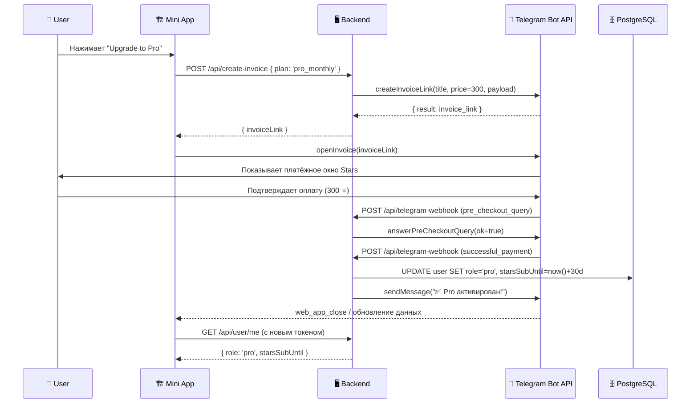

# Telegram Stars Billing (Pro)

> **Оплата Pro-подписки через Telegram Stars** — 300 Stars = ~$3/мес. Альтернатива: Stripe + Crypto для Web-версии.

---

## 1. Flow оплаты



---

## 2. API: POST /api/create-invoice

```typescript
// app/api/create-invoice/route.ts
import { NextRequest, NextResponse } from 'next/server';
import { requireAuth } from '@/lib/auth/middleware';
import { prisma } from '@/lib/prisma';

const BOT_TOKEN = process.env.TELEGRAM_BOT_TOKEN!;
const PROVIDER_TOKEN = process.env.TELEGRAM_STARS_PROVIDER_TOKEN!; // XTR

const PLANS = {
  pro_monthly: {
    title: 'CV Pro — 1 месяц',
    description: 'Полный доступ: AI-анализ, неограниченные просмотры, приоритет в поиске',
    price: 300, // Telegram Stars
    currency: 'XTR',
    days: 30,
  },
} as const;

export async function POST(req: NextRequest) {
  const user = await requireAuth(req);
  if (!user) {
    return NextResponse.json({ error: 'Unauthorized' }, { status: 401 });
  }

  const { plan } = await req.json();
  const config = PLANS[plan as keyof typeof PLANS];
  if (!config) {
    return NextResponse.json({ error: 'Invalid plan' }, { status: 400 });
  }

  // Уникальный payload для привязки платежа к пользователю
  const payload = `${user.id}:${plan}:${Date.now()}`;

  const res = await fetch(
    `https://api.telegram.org/bot${BOT_TOKEN}/createInvoiceLink`,
    {
      method: 'POST',
      headers: { 'Content-Type': 'application/json' },
      body: JSON.stringify({
        title: config.title,
        description: config.description,
        payload,
        currency: config.currency,
        prices: [{ label: config.title, amount: config.price }],
        provider_token: PROVIDER_TOKEN,
      }),
    },
  );

  const data = await res.json();
  if (!data.ok) {
    console.error('[createInvoiceLink]', data);
    return NextResponse.json({ error: 'Failed to create invoice' }, { status: 500 });
  }

  return NextResponse.json({ invoiceLink: data.result });
}
```

---

## 3. Webhook: /api/telegram-webhook

```typescript
// app/api/telegram-webhook/route.ts
import { NextRequest, NextResponse } from 'next/server';
import { prisma } from '@/lib/prisma';
import { sendTelegramNotification } from '@/lib/telegram/notify';

const BOT_TOKEN = process.env.TELEGRAM_BOT_TOKEN!;

export async function POST(req: NextRequest) {
  const update = await req.json();

  // --- pre_checkout_query ---
  if (update.pre_checkout_query) {
    const query = update.pre_checkout_query;
    // Можно проверить payload, сумму и т.д.
    const ok = query.total_amount === 300 && query.currency === 'XTR';

    await fetch(
      `https://api.telegram.org/bot${BOT_TOKEN}/answerPreCheckoutQuery`,
      {
        method: 'POST',
        headers: { 'Content-Type': 'application/json' },
        body: JSON.stringify({
          pre_checkout_query_id: query.id,
          ok,
          error_message: ok ? undefined : 'Invalid payment data',
        }),
      },
    );

    return NextResponse.json({ ok: true });
  }

  // --- successful_payment ---
  if (update.message?.successful_payment) {
    const msg = update.message;
    const payment = msg.successful_payment;
    const [userId, plan] = payment.invoice_payload.split(':');

    const config = PLANS[plan as keyof typeof PLANS];
    if (!config) {
      return NextResponse.json({ error: 'Unknown plan' }, { status: 400 });
    }

    // Активируем Pro
    await prisma.user.update({
      where: { id: userId },
      data: {
        role: 'pro',
        starsSubUntil: new Date(Date.now() + config.days * 86400_000),
      },
    });

    // Уведомление
    await sendTelegramNotification(
      msg.chat.id,
      `✅ <b>Pro-доступ активирован!</b>\n\n`
        + `Срок: до ${new Date(Date.now() + config.days * 86400_000).toLocaleDateString('ru-RU')}\n`
        + `Спасибо за поддержку! 🚀`,
      { parse_mode: 'HTML' },
    );

    return NextResponse.json({ ok: true });
  }

  return NextResponse.json({ ok: true });
}
```

---

## 4. Альтернативные способы оплаты (Web)

| Способ | Провайдер | Комиссия | Валюта | Особенности |
|--------|-----------|----------|--------|-------------|
| **Stripe** | stripe.com | 2.9% + $0.30 | USD, EUR | Карты, Apple Pay, Google Pay |
| **Crypto** | Coinbase Commerce / Solana Pay | 0–1% | USDC, SOL, ETH | Без KYC, мгновенно |

### Stripe Checkout (Next.js)

```typescript
// app/api/create-checkout/route.ts
import { NextRequest, NextResponse } from 'next/server';
import Stripe from 'stripe';

const stripe = new Stripe(process.env.STRIPE_SECRET_KEY!);

export async function POST(req: NextRequest) {
  const { userId } = await req.json();

  const session = await stripe.checkout.sessions.create({
    mode: 'subscription',
    line_items: [{ price: process.env.STRIPE_PRO_PRICE_ID!, quantity: 1 }],
    metadata: { userId },
    success_url: `${process.env.NEXT_PUBLIC_URL}/pro/success`,
    cancel_url: `${process.env.NEXT_PUBLIC_URL}/pro/cancel`,
  });

  return NextResponse.json({ url: session.url });
}
```

### Crypto (Solana Pay)

```typescript
// app/api/create-crypto-invoice/route.ts
import { NextRequest, NextResponse } from 'next/server';

export async function POST(req: NextRequest) {
  const { userId } = await req.json();

  // Создаём счёт в USDC на 30 дней
  const invoice = {
    recipient: process.env.SOLANA_RECEIVER_WALLET!,
    amount: 3, // $3 = 3 USDC
    memo: `pro:${userId}:${Date.now()}`,
  };

  return NextResponse.json({
    qrData: `solana:${invoice.recipient}?amount=${invoice.amount}&memo=${invoice.memo}`,
    amount: invoice.amount,
    currency: 'USDC',
  });
}
```

---

## 5. Pricing

| План | Цена | Telegram Stars | Stripe | Crypto | Фичи |
|------|------|---------------|--------|--------|------|
| **Guest** | Бесплатно | — | — | — | Просмотр 1 CV, базовая инфа |
| **Free** | Бесплатно | — | — | — | 5 просмотров/мес, базовый AI-анализ |
| **Pro** | **$3/мес** | **300 ⭐** | **$3** | **3 USDC** | Безлимитно, AI-анализ, приоритет в поиске, кастомный URL |

### Telegram Stars pricing

| Товар | Stars | Эквивалент USD |
|-------|-------|----------------|
| 1 месяц Pro | 300 ⭐ | ~$3 |
| 6 месяцев Pro | 1 500 ⭐ | ~$15 (скидка ~17%) |
| 12 месяцев Pro | 2 700 ⭐ | ~$27 (скидка ~25%) |

---

## 6. Структура БД (дополнение к User)

```prisma
model User {
  // ... поля из 01-tg-integration.md

  starsSubUntil DateTime?  // дата окончания Pro-подписки
  // role: 'guest' | 'free' | 'pro'
}

// Для отслеживания платежей
model Payment {
  id            String   @id @default(cuid())
  userId        String
  provider      String   // 'telegram_stars' | 'stripe' | 'crypto'
  providerTxId  String?  // ID транзакции у провайдера
  amount        Int      // в минимальных единицах (stars / cents / usdc cents)
  currency      String   // 'XTR' | 'USD' | 'USDC'
  plan          String   // 'pro_monthly'
  status        String   // 'completed' | 'refunded'
  createdAt     DateTime @default(now())

  user User @relation(fields: [userId], references: [id])
}
```

---

## 7. Проверка подписки (middleware)

```typescript
// lib/auth/subscription.ts
import { prisma } from '@/lib/prisma';

export async function checkProAccess(userId: string): Promise<boolean> {
  const user = await prisma.user.findUnique({
    where: { id: userId },
    select: { role: true, starsSubUntil: true },
  });

  if (!user) return false;
  if (user.role === 'pro' && user.starsSubUntil && user.starsSubUntil > new Date()) {
    return true;
  }

  // Если подписка истекла — понижаем роль
  if (user.role === 'pro' && user.starsSubUntil && user.starsSubUntil <= new Date()) {
    await prisma.user.update({
      where: { id: userId },
      data: { role: 'free', starsSubUntil: null },
    });
    return false;
  }

  return false;
}
```

---

## 8. Webhook set-up (однократно)

```bash
# Установка webhook для бота
curl -X POST "https://api.telegram.org/bot<BOT_TOKEN>/setWebhook" \
  -H "Content-Type: application/json" \
  -d '{
    "url": "https://cv.sarkhan.dev/api/telegram-webhook",
    "allowed_updates": ["pre_checkout_query", "message"]
  }'
```
