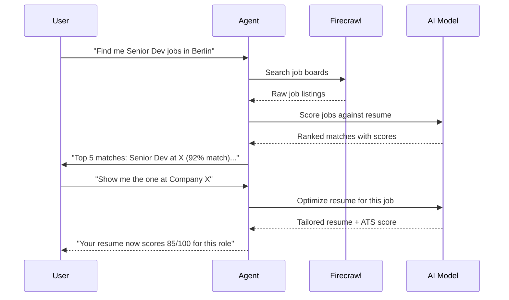

# Job Search

**Status:** Draft  
**Last Updated:** 2026-07-03  
**Owner:** CTO (Sarkhan)

## Overview

Поиск вакансий через Firecrawl API + AI scoring. Pro-фича.

## Flow



## Implementation

```typescript
// POST /api/search-jobs
export async function POST(req: Request) {
  const { query, location, resume } = await req.json();
  
  // Search via Firecrawl
  const jobs = await firecrawl.search({
    query: `${query} ${location} job`,
    sites: ['linkedin.com/jobs', 'indeed.com', 'glassdoor.com'],
    limit: 20,
  });
  
  // Score each job against resume
  const scored = await Promise.all(
    jobs.map(async (job) => {
      const score = await routeWithFallback('scoring', `
        Score this job match against the candidate's resume (0-100).
        Consider: skills match, experience level, industry, location.
        
        Resume: ${JSON.stringify(resume)}
        Job: ${JSON.stringify(job)}
        
        Return: { score, matched_skills, missing_skills, reasoning }
      `);
      return { ...job, score: JSON.parse(score) };
    })
  );
  
  // Sort by score
  scored.sort((a, b) => b.score.score - a.score.score);
  
  return Response.json({ jobs: scored.slice(0, 10) });
}
```
