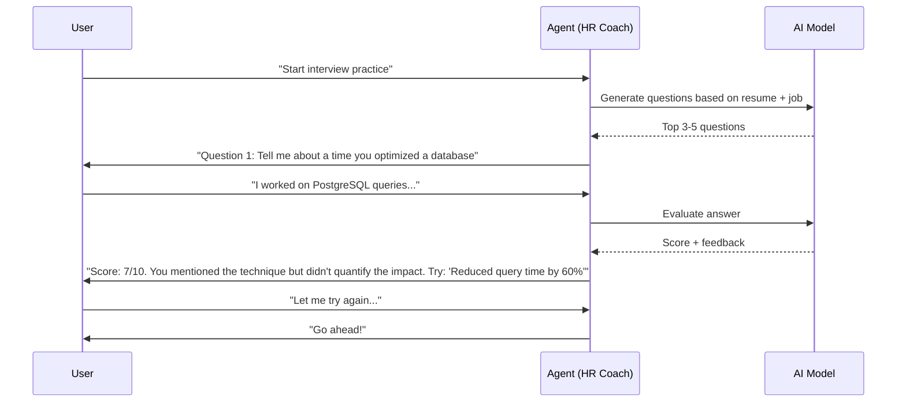

# Interactive HR-Coach

**Status:** Draft  
**Last Updated:** 2026-07-03  
**Owner:** CTO (Sarkhan)

## Overview

Симулятор собеседований. Агент включает режим «Душный HR/Техлид» и проводит текстовую/голосовую симуляцию.

## Flow



## Question Generation

```typescript
function generateQuestions(resume: ResumeData, jobDescription: string): Question[] {
  const prompt = `
    Generate 5 interview questions for this candidate.
    Base questions on their resume and the target job.
    Mix of: behavioral (STAR method), technical, and situational.
    
    Resume: ${JSON.stringify(resume)}
    Job: ${jobDescription}
    
    Return JSON array: [{ "type": "behavioral"|"technical"|"situational", "question": "...", "focus": "..." }]
  `;
  
  return routeWithFallback('ats', prompt);
}
```

## Answer Evaluation

```typescript
function evaluateAnswer(question: Question, answer: string): Evaluation {
  const prompt = `
    Evaluate this interview answer.
    
    Question: ${question.question}
    Answer: ${answer}
    
    Score 1-10 on:
    - Relevance (does it answer the question?)
    - Specificity (are there concrete examples?)
    - STAR method (Situation, Task, Action, Result)
    - Clarity
    
    Return JSON: { score, breakdown: { relevance, specificity, star, clarity }, feedback, improved_answer }
  `;
  
  return routeWithFallback('ats', prompt);
}
```

## Modes

| Mode | Tone | Focus |
|------|------|-------|
| **Friendly HR** | Supportive | General questions, culture fit |
| **Dushniy HR** | Demanding | Deep dives, pressure test |
| **Tech Lead** | Technical | System design, coding concepts |
| **Behavioral** | Structured | STAR method practice |
