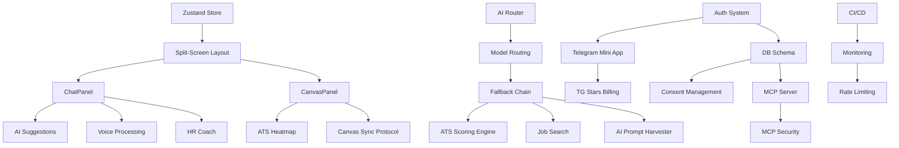

# Gap Analysis: AS IS → TO BE

> **Дата:** 2026-07-05
> **Проект:** cv.sarkhan.dev
> **Тип:** Gap Analysis (Phase 0 — Audit)
> **Статус:** ✅ Завершён

---

## 1. Общий обзор AS IS (текущее состояние)

### 1.1 Технологический стек

| Компонент | AS IS | TO BE |
|-----------|-------|-------|
| Frontend | Next.js 16 + Tailwind CSS 4 | Next.js + Tailwind CSS |
| State Management | React useState (локальный) | Zustand / Jotai |
| AI Integration | Gemini 2.5 Flash (только) | Multi-model router |
| PDF Generation | @react-pdf/renderer | @react-pdf/renderer |
| Forms | react-hook-form + zod | react-hook-form + zod |
| UI Library | shadcn/ui (частично) | Custom components |
| Auth | Нет (заглушка "Sign In") | NextAuth.js + Telegram OAuth |
| Database | Нет | PostgreSQL + Prisma |
| Storage | localStorage (только) | localStorage + PostgreSQL |
| CI/CD | Нет | GitHub Actions |
| Monitoring | Нет | Sentry + Vercel Analytics |
| MCP Server | Нет | MCP SDK Server |

### 1.2 Текущие маршруты

| Маршрут | Назначение | Статус |
|---------|-----------|--------|
| `/` | Landing page с 3 карточками | ✅ Работает |
| `/create` | Создание резюме (форма + превью) | ✅ Работает |
| `/update` | Улучшение существующего резюме | ✅ Работает |
| `/import` | Импорт LinkedIn (базовый) | ⚠️ Заглушка |
| `/signin` | Заглушка | ❌ Не реализован |

### 1.3 Текущие API-маршруты

| Маршрут | Назначение | Модель |
|---------|-----------|--------|
| `POST /api/generate` | Генерация резюме | Gemini 2.5 Flash |
| `POST /api/update` | Улучшение/таргетинг резюме | Gemini 2.5 Flash |
| `POST /api/assess` | Оценка резюме | Gemini 2.5 Flash Lite |

### 1.4 Текущие компоненты

- **Layout:** Header, MobileNav, BackgroundFX
- **Forms:** CreateResumeForm, UpdateResumeForm
- **Preview:** LivePreview, 3 шаблона (Classic, Modern, Creative)
- **AI:** ATSScoreCard (client-side, rule-based), AssessmentResultDisplay
- **PDF:** DownloadPdfButton, 3 PDF-шаблона
- **UI:** Tabs, Button, Input, Textarea, Label, Form
- **Utilities:** AutoSaveIndicator, ValidationMessage, ScoreCircle, SkeletonPreview, ThemeToggle, ColorPalette, TemplateSelector, FillSampleDataButton, AchievementsSuggestions

---

## 2. Поэлементное сравнение AS IS → TO BE

### 2.1 Архитектура (01-architecture/)

#### 2.1.1 Split-Screen Layout
**Источник:** `01-architecture/01-to-be-overview.md`

| Аспект | AS IS | TO BE | Статус |
|--------|-------|-------|--------|
| Двухпанельный интерфейс | ✅ Есть (форма слева, превью справа) | Чат (30-35%) + Canvas (65-70%) | 🔄 Нужно переделать |
| Resize handle | ❌ Нет | Изменяемый сплиттер | ❌ Отсутствует |
| Mobile tabs | ❌ Нет | Chat/Canvas табы | ❌ Отсутствует |
| Чат-интерфейс | ❌ Нет (форма вместо чата) | Диалоговый AI-агент | ❌ Отсутствует |
| Canvas (интерактивный) | ❌ Только превью | Кликабельные блоки, ATS Heatmap | ❌ Отсутствует |

**Сложность:** 4/5
**Зависимости:** Zustand store, ChatPanel, CanvasPanel

#### 2.1.2 Privacy-First Storage
**Источник:** `01-architecture/02-storage-strategies.md`

| Аспект | AS IS | TO BE | Статус |
|--------|-------|-------|--------|
| localStorage для гостей | ✅ useAutoSave hook | LocalStorageAdapter | ⚠️ Частично (нет TTL, нет LRU) |
| IndexedDB fallback | ❌ Нет | IndexedDBAdapter | ❌ Отсутствует |
| PostgreSQL для registered | ❌ Нет | PostgreSQL + Prisma | ❌ Отсутствует |
| Guest → Registered migration | ❌ Нет | migrateGuestToRegistered() | ❌ Отсутствует |
| GDPR consent | ❌ Нет | Consent log, GDPR checklist | ❌ Отсутствует |
| AutoSaveManager | ✅ useAutoSave (простой) | AutoSaveManager с debounce | ⚠️ Частично |

**Сложность:** 4/5
**Зависимости:** Prisma setup, PostgreSQL, Auth system

#### 2.1.3 Model Routing Chain
**Источник:** `01-architecture/03-model-routing-chain.md`

| Аспект | AS IS | TO BE | Статус |
|--------|-------|-------|--------|
| Multi-model routing | ❌ Только Gemini | 6 task types, 4+ models | ❌ Отсутствует |
| Fallback chain | ❌ Нет | Каскадный fallback | ❌ Отсутствует |
| Task-aware routing | ❌ Нет | Dialogue/Parsing/ATS/Search/Voice | ❌ Отсутствует |
| User profile detection | ❌ Нет | Senior/Junior/Non-tech/Manager | ❌ Отсутствует |
| Routing metrics | ❌ Нет | OpenTelemetry / Prometheus | ❌ Отсутствует |

**Сложность:** 3/5
**Зависимости:** Multi-provider SDK setup

### 2.2 Conversational UI (02-conversational-ui/)

#### 2.2.1 Agent Flow
**Источник:** `02-conversational-ui/01-agent-flow.md`

| Аспект | AS IS | TO BE | Статус |
|--------|-------|-------|--------|
| AI-first Workspace | ❌ Формы вместо чата | Единый Workspace | ❌ Отсутствует |
| Chat input | ❌ Нет | Многострочное поле + 🎤 | ❌ Отсутствует |
| Quick Action Buttons | ❌ Нет | [Импорт LinkedIn] [Подогнать] [Улучшить ATS] | ❌ Отсутствует |
| Suggestion Chips | ❌ Нет | [Apply] [Edit] [Dismiss] | ❌ Отсутствует |
| Agent tone adaptation | ❌ Нет | Senior/Junior/Non-tech | ❌ Отсутствует |
| State machine | ❌ Нет | Idle → Loading → Ready → Chatting → Suggesting | ❌ Отсутствует |

**Сложность:** 5/5
**Зависимости:** Split-Screen, AI Router, Canvas

#### 2.2.2 LinkedIn Integration
**Источник:** `02-conversational-ui/02-linkedin-integration.md`

| Аспект | AS IS | TO BE | Статус |
|--------|-------|-------|--------|
| LinkedIn URL input | ✅ Базовая форма | Через агента | ⚠️ Частично |
| LinkedIn scraper MCP | ❌ Нет | @anthropic/linkedin-scraper-mcp | ❌ Отсутствует |
| AI parsing | ✅ parseLinkedInProfile() | parseProfileWithAI() | ⚠️ Частично (только Gemini) |
| Canvas fill | ❌ Только текст | structuredProfile → Canvas | ❌ Отсутствует |
| Error handling | ❌ Нет | 5 error scenarios | ❌ Отсутствует |

**Сложность:** 3/5
**Зависимости:** MCP Server, AI Router

#### 2.2.3 AI Suggestions
**Источник:** `02-conversational-ui/03-ai-suggestions.md`

| Аспект | AS IS | TO BE | Статус |
|--------|-------|-------|--------|
| Rule-based suggestions | ✅ ATSScoreCard (client-side) | checkMetricsMissing, checkActionVerbs, checkKeywordGaps | ⚠️ Частично |
| AI suggestions | ❌ Нет | generateAISuggestions() | ❌ Отсутствует |
| Severity badges | ❌ Нет | High/Medium/Low | ❌ Отсутствует |
| SuggestionPanel UI | ❌ Нет | Компонент с Apply/Dismiss | ❌ Отсутствует |
| Real-time analysis | ❌ Нет | Debounced + incremental | ❌ Отсутствует |

**Сложность:** 3/5
**Зависимости:** AI Router, ChatPanel

#### 2.2.4 Voice Processing
**Источник:** `02-conversational-ui/04-voice-processing.md`

| Аспект | AS IS | TO BE | Статус |
|--------|-------|-------|--------|
| Microphone button | ❌ Нет | 🎤 кнопка в ChatInput | ❌ Отсутствует |
| Web Audio API capture | ❌ Нет | VoiceCapture class | ❌ Отсутствует |
| Deepgram transcription | ❌ Нет | Nova-2 модель | ❌ Отсутствует |
| Whisper fallback | ❌ Нет | whisper.cpp / OpenAI API | ❌ Отсутствует |
| Voice-to-resume extraction | ❌ Нет | POST /api/extract-from-voice | ❌ Отсутствует |
| Telegram voice support | ❌ Нет | .ogg через Bot API | ❌ Отсутствует |

**Сложность:** 4/5
**Зависимости:** AI Router, ChatPanel

#### 2.2.5 Canvas Sync Protocol
**Источник:** `02-conversational-ui/05-canvas-sync-protocol.md`

| Аспект | AS IS | TO BE | Статус |
|--------|-------|-------|--------|
| Zustand store | ❌ Нет | useResumeStore с persist | ❌ Отсутствует |
| Event system | ❌ Нет | CanvasEvent, ChatEvent, SyncEvent | ❌ Отсутствует |
| SSE streaming | ❌ Нет | CanvasSSEService | ❌ Отсутствует |
| Undo/Redo | ❌ Нет | history stack (50 entries) | ❌ Отсутствует |
| Conflict resolution | ❌ Нет | Optimistic Locking + LWW | ❌ Отсутствует |
| Block tap → Chat focus | ❌ Нет | Micro-interaction | ❌ Отсутствует |

**Сложность:** 4/5
**Зависимости:** Zustand, Split-Screen, ChatPanel, CanvasPanel

#### 2.2.6 AI Prompt Harvester
**Источник:** `02-conversational-ui/06-ai-prompt-harvester.md`

| Аспект | AS IS | TO BE | Статус |
|--------|-------|-------|--------|
| Harvester panel | ❌ Нет | HarvesterPanel компонент | ❌ Отсутствует |
| Prompt generation | ❌ Нет | ChatGPT/Claude prompts | ❌ Отсутствует |
| Data validation | ❌ Нет | Zod schema validation | ❌ Отсутствует |
| Hallucination detection | ❌ Нет | HallucinationDetector | ❌ Отсутствует |
| Auto-correction | ❌ Нет | AutoCorrector | ❌ Отсутствует |

**Сложность:** 3/5
**Зависимости:** AI Router, Canvas

### 2.3 Storage (03-storage/)

#### 2.3.1 DB Schema
**Источник:** `03-storage/01-db-schema.md`

| Аспект | AS IS | TO BE | Статус |
|--------|-------|-------|--------|
| users table | ❌ Нет | 6 таблиц с индексами | ❌ Отсутствует |
| subscriptions table | ❌ Нет | tier, provider, period | ❌ Отсутствует |
| consent_log table | ❌ Нет | Append-only, immutable | ❌ Отсутствует |
| resumes table | ❌ Нет | JSONB, version, ats_score | ❌ Отсутствует |
| resume_versions table | ❌ Нет | Full history | ❌ Отсутствует |
| mcp_tokens table | ❌ Нет | Token hash, scopes | ❌ Отсутствует |
| pro_tokens table | ❌ Нет | Bcrypt hash, prefix | ❌ Отсутствует |
| mcp_logs table | ❌ Нет | Audit trail | ❌ Отсутствует |
| payments table | ❌ Нет | Provider, amount, status | ❌ Отсутствует |

**Сложность:** 3/5
**Зависимости:** PostgreSQL, Prisma

#### 2.3.2 Consent Management
**Источник:** `03-storage/02-consent-management.md`

| Аспект | AS IS | TO BE | Статус |
|--------|-------|-------|--------|
| Consent dialog | ❌ Нет | GDPR consent flow | ❌ Отсутствует |
| POST /api/consent | ❌ Нет | Append-only log | ❌ Отсутствует |
| GET /api/export-data | ❌ Нет | GDPR Art. 20 | ❌ Отсутствует |
| DELETE /api/delete-account | ❌ Нет | GDPR Art. 17 | ❌ Отсутствует |
| Consent freshness check | ❌ Нет | Policy version tracking | ❌ Отсутствует |

**Сложность:** 2/5
**Зависимости:** DB Schema, Auth

#### 2.3.3 LocalStorage Fallback
**Источник:** `03-storage/03-localstorage-fallback.md`

| Аспект | AS IS | TO BE | Статус |
|--------|-------|-------|--------|
| IStorage interface | ❌ Нет | set/get/remove/has/clear/keys/info | ❌ Отсутствует |
| LocalStorageAdapter | ✅ useAutoSave (простой) | TTL, versioning, LRU eviction | ⚠️ Частично |
| IndexedDBAdapter | ❌ Нет | >5MB fallback | ❌ Отсутствует |
| AutoSaveManager | ✅ useAutoSave | Debounce, retry, storage selection | ⚠️ Частично |

**Сложность:** 2/5
**Зависимости:** Нет

### 2.4 AI Layer (04-ai/)

#### 2.4.1 Model Routing
**Источник:** `04-ai/01-model-routing.md`

| Аспект | AS IS | TO BE | Статус |
|--------|-------|-------|--------|
| MODEL_ROUTES config | ❌ Нет | 6 task types with primary + fallbacks | ❌ Отсутствует |
| Task routing | ❌ Нет | Dialogue/Parsing/ATS/Search/Voice/Scoring | ❌ Отсутствует |

**Сложность:** 2/5
**Зависимости:** Multi-provider SDK

#### 2.4.2 Fallback Chain
**Источник:** `04-ai/02-fallback-chain.md`

| Аспект | AS IS | TO BE | Статус |
|--------|-------|-------|--------|
| callWithFallback() | ❌ Нет | Cascade through models | ❌ Отсутствует |
| Timeout handling | ❌ Нет | AbortController per model | ❌ Отсутствует |
| Universal fallback | ❌ Нет | Gemini 2.5 Flash | ❌ Отсутствует |

**Сложность:** 2/5
**Зависимости:** Model Routing

#### 2.4.3 Prompt Templates
**Источник:** `04-ai/03-prompt-templates.md`

| Аспект | AS IS | TO BE | Статус |
|--------|-------|-------|--------|
| Resume generation prompt | ✅ Встроен в API | Шаблон с переменными | ⚠️ Частично |
| ATS optimization prompt | ✅ Встроен в API | Шаблон с переменными | ⚠️ Частично |
| LinkedIn parsing prompt | ✅ Встроен в linkedin-parser | Шаблон с переменными | ⚠️ Частично |
| Voice-to-resume prompt | ❌ Нет | Шаблон | ❌ Отсутствует |
| AI Harvester prompt | ❌ Нет | Шаблон | ❌ Отсутствует |

**Сложность:** 1/5
**Зависимости:** Нет

### 2.5 MCP Server (05-mcp-server/)

#### 2.5.1 MCP API Spec
**Источник:** `05-mcp-server/01-mcp-api-spec.md`

| Аспект | AS IS | TO BE | Статус |
|--------|-------|-------|--------|
| MCP Server | ❌ Нет | @modelcontextprotocol/sdk | ❌ Отсутствует |
| update_resume tool | ❌ Нет | Update resume sections | ❌ Отсутствует |
| get_resume tool | ❌ Нет | Get full resume JSON | ❌ Отсутствует |
| analyze_resume tool | ❌ Нет | Analyze vs job description | ❌ Отсутствует |
| Telegram push notifications | ❌ Нет | sendMessage on update | ❌ Отсутствует |

**Сложность:** 3/5
**Зависимости:** DB Schema, Auth, Telegram Bot

#### 2.5.2 MCP Security & Auth
**Источник:** `05-mcp-server/02-mcp-security-auth.md`

| Аспект | AS IS | TO BE | Статус |
|--------|-------|-------|--------|
| Pro token generation | ❌ Нет | crypto.randomUUID + bcrypt | ❌ Отсутствует |
| Token validation | ❌ Нет | bcrypt.compare + rate limit | ❌ Отсутствует |
| Rate limiting (MCP) | ❌ Нет | 100 req/h + 10 req/min burst | ❌ Отсутствует |
| Audit logging | ❌ Нет | mcp_logs table | ❌ Отсутствует |
| Token management API | ❌ Нет | CRUD /api/pro/tokens | ❌ Отсутствует |
| Security headers | ❌ Нет | Helmet, HSTS, CSP | ❌ Отсутствует |

**Сложность:** 3/5
**Зависимости:** MCP Server, DB Schema

### 2.6 Telegram Mini App (06-telegram-miniapp/)

#### 2.6.1 TG Integration
**Источник:** `06-telegram-miniapp/01-tg-integration.md`

| Аспект | AS IS | TO BE | Статус |
|--------|-------|-------|--------|
| Telegram Mini App | ❌ Нет | initData validation, auth | ❌ Отсутствует |
| POST /api/auth/telegram | ❌ Нет | HMAC-SHA256 validation | ❌ Отсутствует |
| JWT session tokens | ❌ Нет | signSessionToken() | ❌ Отсутствует |
| Push notifications | ❌ Нет | sendTelegramNotification() | ❌ Отсутствует |
| Prisma User model | ❌ Нет | telegramId, role, starsSubUntil | ❌ Отсутствует |

**Сложность:** 3/5
**Зависимости:** Telegram Bot, DB Schema

#### 2.6.2 TG Stars Billing
**Источник:** `06-telegram-miniapp/02-tg-stars-billing.md`

| Аспект | AS IS | TO BE | Статус |
|--------|-------|-------|--------|
| Telegram Stars payment | ❌ Нет | 300 ⭐/мес | ❌ Отсутствует |
| POST /api/create-invoice | ❌ Нет | createInvoiceLink | ❌ Отсутствует |
| Webhook handler | ❌ Нет | pre_checkout_query + successful_payment | ❌ Отсутствует |
| Stripe alternative | ❌ Нет | Stripe Checkout | ❌ Отсутствует |
| Crypto alternative | ❌ Нет | Solana Pay (USDC) | ❌ Отсутствует |
| Subscription check middleware | ❌ Нет | checkProAccess() | ❌ Отсутствует |

**Сложность:** 4/5
**Зависимости:** Telegram Bot, DB Schema, Auth

### 2.7 Recommendations (07-recommendations/)

#### 2.7.1 Job Search
**Источник:** `07-recommendations/01-job-search.md`

| Аспект | AS IS | TO BE | Статус |
|--------|-------|-------|--------|
| Firecrawl integration | ❌ Нет | Search job boards | ❌ Отсутствует |
| AI job scoring | ❌ Нет | Score vs resume | ❌ Отсутствует |
| POST /api/search-jobs | ❌ Нет | Search + score + rank | ❌ Отсутствует |

**Сложность:** 3/5
**Зависимости:** AI Router, Firecrawl API key

#### 2.7.2 ATS Scoring Engine
**Источник:** `07-recommendations/02-ats-scoring-engine.md`

| Аспект | AS IS | TO BE | Статус |
|--------|-------|-------|--------|
| AI-powered ATS scoring | ❌ Client-side only | routeWithFallback('scoring') | ❌ Отсутствует |
| Canvas heatmap | ❌ Нет | Green/Yellow/Red per section | ❌ Отсутствует |
| Section-level scores | ❌ Нет | Summary/Experience/Skills | ❌ Отсутствует |
| POST /api/ats-score | ❌ Нет | AI analysis endpoint | ❌ Отсутствует |

**Сложность:** 2/5
**Зависимости:** AI Router, Canvas

#### 2.7.3 Interactive HR Coach
**Источник:** `07-recommendations/03-interactive-coach.md`

| Аспект | AS IS | TO BE | Статус |
|--------|-------|-------|--------|
| Interview simulator | ❌ Нет | Question generation | ❌ Отсутствует |
| Answer evaluation | ❌ Нет | Score + feedback | ❌ Отсутствует |
| 4 modes | ❌ Нет | Friendly HR / Dushniy HR / Tech Lead / Behavioral | ❌ Отсутствует |

**Сложность:** 3/5
**Зависимости:** AI Router, ChatPanel

### 2.8 Design (08-design/)

#### 2.8.1 Design References
**Источник:** `08-design/01-design-references.md`

| Аспект | AS IS | TO BE | Статус |
|--------|-------|-------|--------|
| Color palette | ✅ Тёмная тема | Indigo accent, glassmorphism | ⚠️ Частично |
| Typography | ✅ Inter + Space Grotesk | Inter + JetBrains Mono | ⚠️ Частично |
| Split-screen layout | ✅ Форма + превью | Чат + Canvas | 🔄 Нужно переделать |

**Сложность:** 2/5
**Зависимости:** Split-Screen refactor

#### 2.8.2 Component Library
**Источник:** `08-design/02-component-library.md`

| Аспект | AS IS | TO BE | Статус |
|--------|-------|-------|--------|
| AppShell | ❌ Нет | Header + SplitScreen + MobileNav | ❌ Отсутствует |
| ChatPanel | ❌ Нет | ChatHeader, MessageList, SuggestionChips, VoiceButton, ChatInput | ❌ Отсутствует |
| CanvasPanel | ❌ Нет | ResumeCanvas, SectionBlock, ATSScoreBadge, ActionToolbar | ❌ Отсутствует |
| Shared components | ✅ Button, Input, Badge | + Tooltip, Modal, Toast, Spinner, Avatar | ⚠️ Частично |

**Сложность:** 4/5
**Зависимости:** Split-Screen, Zustand

### 2.9 Deployment (09-deployment/)

#### 2.9.1 CI/CD
**Источник:** `09-deployment/01-ci-cd.md`

| Аспект | AS IS | TO BE | Статус |
|--------|-------|-------|--------|
| GitHub Actions | ❌ Нет | Lint + type-check + test + build + e2e + deploy | ❌ Отсутствует |
| Branch strategy | ❌ Нет | main/develop/feature/fix | ❌ Отсутствует |
| Vercel auto-deploy | ❌ Нет | amondnet/vercel-action | ❌ Отсутствует |

**Сложность:** 2/5
**Зависимости:** GitHub repo setup

#### 2.9.2 Monitoring
**Источник:** `09-deployment/02-monitoring.md`

| Аспект | AS IS | TO BE | Статус |
|--------|-------|-------|--------|
| Sentry | ❌ Нет | Error tracking + performance | ❌ Отсутствует |
| Vercel Analytics | ❌ Нет | Web vitals | ❌ Отсутствует |
| AI model monitoring | ❌ Нет | Latency, fallback usage | ❌ Отсутствует |
| Alerts | ❌ Нет | Error rate, AI latency, fallback exhausted | ❌ Отсутствует |

**Сложность:** 2/5
**Зависимости:** Sentry account, Vercel

#### 2.9.3 Rate Limiting
**Источник:** `09-deployment/03-rate-limiting.md`

| Аспект | AS IS | TO BE | Статус |
|--------|-------|-------|--------|
| Upstash rate limiting | ❌ Нет | Sliding window per tier | ❌ Отсутствует |
| Tier-based limits | ❌ Нет | Guest/Free/Pro limits | ❌ Отсутствует |
| Rate limit headers | ❌ Нет | X-RateLimit-* headers | ❌ Отсутствует |

**Сложность:** 2/5
**Зависимости:** Upstash account, Auth

---

## 3. Сводка по категориям

| Категория | ✅ Готово | ⚠️ Частично | ❌ Отсутствует | 🔄 Нужно переделать |
|-----------|-----------|-------------|----------------|---------------------|
| **01-architecture** | 0 | 2 | 5 | 1 |
| **02-conversational-ui** | 0 | 3 | 20 | 0 |
| **03-storage** | 0 | 2 | 10 | 0 |
| **04-ai** | 0 | 3 | 3 | 0 |
| **05-mcp-server** | 0 | 0 | 10 | 0 |
| **06-telegram-miniapp** | 0 | 0 | 9 | 0 |
| **07-recommendations** | 0 | 0 | 7 | 0 |
| **08-design** | 0 | 3 | 2 | 1 |
| **09-deployment** | 0 | 0 | 9 | 0 |
| **ИТОГО** | **0** | **13** | **75** | **2** |

---

## 4. Ключевые зависимости между изменениями

### Критический путь (Critical Path)

1. **Фаза 1 — Foundation:** Zustand Store → DB Schema → Auth System
2. **Фаза 2 — Core UI:** Split-Screen → ChatPanel + CanvasPanel → Canvas Sync Protocol
3. **Фаза 3 — AI Layer:** AI Router → Model Routing → Fallback Chain
4. **Фаза 4 — Features:** AI Suggestions → Voice → HR Coach → Job Search
5. **Фаза 5 — Integration:** Telegram Mini App → MCP Server → Billing
6. **Фаза 6 — Infrastructure:** CI/CD → Monitoring → Rate Limiting

### Блокирующие зависимости

| Что блокирует | Что нужно сначала |
|---------------|-------------------|
| ChatPanel, CanvasPanel | Zustand Store |
| AI Suggestions, Voice, HR Coach | ChatPanel |
| ATS Heatmap | CanvasPanel + AI Router |
| Telegram Mini App | Auth System + DB Schema |
| MCP Server | DB Schema + Auth System |
| TG Stars Billing | Telegram Mini App |
| Job Search | AI Router + Firecrawl |
| CI/CD | GitHub repo + Vercel |

---

## 5. Оценка сложности по фазам

| Фаза | Компоненты | Сложность | Человеко-дней |
|------|-----------|-----------|---------------|
| **P1 — Foundation** | Zustand, DB, Auth, Storage | 4/5 | 5-7 |
| **P2 — Core UI** | Split-Screen, Chat, Canvas, Sync | 5/5 | 7-10 |
| **P3 — AI Layer** | Router, Routing, Fallback, Prompts | 3/5 | 3-5 |
| **P4 — Features** | Suggestions, Voice, Coach, Search, Harvester | 4/5 | 5-8 |
| **P5 — Integration** | Telegram, MCP, Billing | 4/5 | 5-7 |
| **P6 — Infrastructure** | CI/CD, Monitoring, Rate Limiting | 2/5 | 2-3 |
| **ИТОГО** | **90 пунктов изменений** | **4/5** | **27-40** |

---

## 6. Что уже хорошо (можно сохранить)

1. **3 шаблона резюме** (Classic, Modern, Creative) — отличная основа для Canvas
2. **PDF-генерация** через @react-pdf/renderer — полностью соответствует TO BE
3. **Client-side ATS scoring** — можно расширить до AI-powered
4. **AutoSave в localStorage** — база для LocalStorageAdapter
5. **Zod-валидация** — можно переиспользовать
6. **Тёмная тема и стеклооморфизм** — соответствует дизайн-референсам
7. **Gemini интеграция** — будет одной из моделей в роутере
8. **LinkedIn парсер** — можно доработать до MCP-интеграции

---

## 7. Риски

| Риск | Вероятность | Влияние | Митигация |
|------|------------|---------|-----------|
| Telegram Mini App требует публикации | Высокая | Среднее | Начать с Web-first, TG потом |
| Multi-model routing дорогой | Средняя | Высокое | Начать с Gemini + fallback, добавлять постепенно |
| GDPR compliance сложный | Средняя | Среднее | Использовать шаблоны consent, консультация юриста |
| Voice processing требует API ключи | Высокая | Низкое | Deepgram + Whisper fallback |
| MCP Server — новая технология | Средняя | Среднее | Использовать готовый SDK |
| Zustand → полный рефакторинг state | Высокая | Высокое | Постепенная миграция,共存 |

---

*Gap Analysis составлен на основе 27 файлов документации и полного аудита кодовой базы.*
